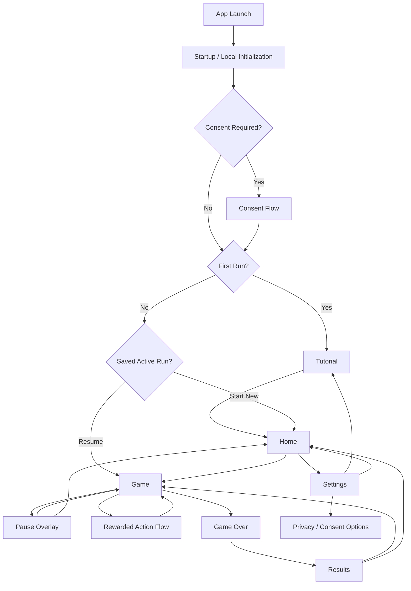

# BlastDown — App Flow Specification

**Document:** `APP_FLOW.md`
**Product:** BlastDown
**Version:** 1.0 Draft
**Status:** For Product Owner Review
**Primary platform:** Android
**Orientation:** Portrait
**Related documents:** `PRD.md`, `TECHNICAL_DESIGN.md`

## A-04 V1 Scope Lock

The production route graph is Home, Tutorial, Gameplay, Pause, Results, and
Settings, with consent/privacy surfaces as required. Rewarded Freeze and Defuse
are the only V1 ad-assisted actions. There is no Bolts or Themes route, no
Double Bolts result action, no rewarded Revive decision, and no interstitial
transition. Legacy stored fields do not create screens or branches.

---

# 1. Purpose

This document defines the complete user flow for BlastDown V1.

It describes:

- what screens and overlays exist;
- how users move between them;
- what happens at startup;
- first-run behavior;
- gameplay navigation;
- pause/restart/home flows;
- game-over/results behavior;
- rewarded Freeze and Defuse flows;
- settings and consent flows;
- active-run resume behavior;
- loading states;
- empty states;
- network failures;
- ad failures;
- persistence failures;
- background/resume behavior;
- development-only routes.

This document defines **navigation and user-visible states**, not visual styling.

Visual appearance belongs in:

```text
UI_UX_BRIEF.md
```

Gameplay rules belong in:

```text
GAME_RULES.md
```

---

# 2. Navigation Principles

BlastDown should minimize navigation friction.

The player should be able to move from launch to gameplay quickly.

Core principle:

> **Launch → understand → play → fail → restart**

No V1 flow should require:

- account creation;
- login;
- profile creation;
- server connectivity;
- unnecessary onboarding forms;
- forced advertisement before first gameplay.

---

# 3. High-Level App Flow



---

# 4. Route Model

Recommended Expo Router routes:

```text
app/
├── _layout.tsx
├── index.tsx
├── game.tsx
├── results.tsx
├── tutorial.tsx
└── settings.tsx
```

Optional dedicated routes may be introduced only when needed.

Prefer overlays/modals for:

- pause;
- restart confirmation;
- rewarded-ad confirmation;
- ad unavailable state;
- privacy choices where SDK-owned;
- game-over transition where appropriate.

Do not create a separate route for every temporary game state.

---

# 5. Screen Inventory

## Production V1

| ID    | Screen / Surface          | Type                            |
| ----- | ------------------------- | ------------------------------- |
| AF-01 | Startup / Bootstrap       | Temporary                       |
| AF-02 | Consent / Privacy Prompt  | Conditional                     |
| AF-03 | Tutorial                  | Screen                          |
| AF-04 | Home                      | Screen                          |
| AF-05 | Resume Active Run Prompt  | Conditional modal/screen state  |
| AF-06 | Gameplay                  | Screen                          |
| AF-07 | Pause                     | Overlay                         |
| AF-08 | Rewarded Freeze           | Modal + external ad             |
| AF-09 | Rewarded Defuse           | Modal + external ad             |
| AF-10 | Game Over                 | Game-state transition / overlay |
| AF-11 | Results                   | Screen                          |
| AF-12 | Settings                  | Screen                          |
| AF-13 | Privacy / Consent Choices | Conditional/settings surface    |
| AF-14 | Generic Recoverable Error | Inline/modal state              |

## Development Only

| ID     | Screen / Surface                                 |
| ------ | ------------------------------------------------ |
| DEV-01 | Effect Harness                                   |
| DEV-02 | Effect Diagnostics Overlay                       |
| DEV-03 | Local analytics/debug diagnostics where retained |

Development-only screens must not be present in production bundles.

---

# 6. Application Startup

## 6.1 Entry

The application starts at:

```text
/
```

The startup route is responsible for bootstrapping local application state before presenting a stable user-facing screen.

---

# 7. Startup Sequence

Startup should resolve in this order:

```text
Launch
   ↓
Load local settings
   ↓
Load best score
   ↓
Load tutorial-completion state
   ↓
Load active-run metadata if supported
   ↓
Initialize application services
   ↓
Determine consent requirement
   ↓
Resolve first-run / resume destination
```

Advertising initialization must not delay core gameplay indefinitely.

Analytics or crash-reporting failure must not block startup.

---

# 8. Startup Loading State

While local state is being restored:

### Show

- BlastDown logo/wordmark;
- dark branded background;
- minimal loading indicator only if initialization is visibly delayed.

### Do not show

- blank white screen;
- gameplay UI before data is ready;
- advertisements;
- consent UI before the consent service is ready to determine whether it is required.

---

# 9. Startup Timeout / Failure

If optional services fail:

```text
analytics failure
ad initialization failure
audio initialization failure
crash provider failure
```

continue into the app.

If local settings fail to load:

- use safe defaults;
- continue;
- do not crash.

If active-run data is invalid or cannot be migrated:

- do not load the corrupt run;
- preserve unaffected settings/best score;
- continue to Home;
- log/report the recovery where available.

---

# 10. Consent Flow

Consent is conditional.

The user should not see a custom consent screen unless consent configuration requires interaction.

Flow:

```text
Startup
  ↓
Consent service determines requirement
  ↓
Required?
  ├─ No → Continue
  └─ Yes → Consent UI
```

The consent UI may be controlled by the Google consent/UMP integration.

---

# 11. Consent Outcomes

Possible outcomes:

```text
consent resolved
limited/non-personalized state
consent not required
consent UI unavailable
consent service error
```

Regardless of outcome:

> Core BlastDown gameplay remains accessible.

An advertising/consent failure must not lock the player out of the game.

---

# 12. First Launch

If tutorial completion is not recorded:

```text
Startup
   ↓
Consent if required
   ↓
Tutorial
```

The player should not be forced through unnecessary menus before learning the game.

---

# 13. Tutorial Flow

The tutorial is playable rather than text-heavy.

Recommended tutorial sequence:

```text
Step 1
Place a piece
"Drag a block onto the board."

        ↓

Step 2
Complete a line
"Complete a row or column to clear it."

        ↓

Step 3
Introduce countdown
"Every placed piece has a countdown."

        ↓

Step 4
Save a timer
"Clear every cell before the timer reaches zero."

        ↓

Step 5
Controlled explosion
"Expired pieces create rubble."

        ↓

Step 6
Clear rubble
"Complete its row or column to repair the board."

        ↓

Tutorial Complete
```

---

# 14. Tutorial Rules

The tutorial should use:

- fixed board state;
- fixed piece sequence;
- deterministic actions;
- no advertisements;
- no interstitials;
- no unpredictable generation.

The tutorial may be skipped after the initial instructional interaction if that behavior remains approved.

---

# 15. Tutorial Completion

At completion:

1. record tutorial completion;
2. persist it locally;
3. transition to Home.

Do not show an advertisement immediately after tutorial completion.

---

# 16. Tutorial Replay

Path:

```text
Home
  ↓
Settings
  ↓
How to Play / Replay Tutorial
  ↓
Tutorial
```

Replaying the tutorial must not reset:

- best score;
- settings;
- other player progress.

---

# 17. Home Screen

The Home screen is the main stable navigation hub.

Minimum V1 actions:

```text
PLAY
SETTINGS
HOW TO PLAY (optional direct shortcut)
PRIVACY (direct or via Settings)
```

Display:

- BlastDown identity;
- best score;
- primary Play action.

---

# 18. Home — No Saved Run

Primary flow:

```text
Home
  ↓
Play
  ↓
Create New Run
  ↓
Gameplay
```

The game should enter gameplay immediately.

Avoid a separate difficulty/level-selection screen because V1 is an endless score-chasing game.

---

# 19. Home — Existing Active Run

If active-run restoration is retained:

```text
Home / Startup
   ↓
Valid saved active run detected
   ↓
Resume decision
```

Recommended options:

```text
RESUME
NEW GAME
```

---

# 20. Resume Existing Run

Selecting:

```text
RESUME
```

must restore:

- board;
- current pieces;
- timers;
- score;
- combo;
- relevant power-up state;
- RNG state;
- session state.

Timers must remain exactly where they were when saved.

No real-world elapsed-time penalty is applied.

---

# 21. Start New Run While Saved Run Exists

Selecting:

```text
NEW GAME
```

should ask for confirmation if an active run would be destroyed.

Example:

```text
Start a new game?

Your current run will be lost.

[CANCEL] [START NEW]
```

Confirm:

```text
delete/replace saved run
→ create fresh session generation
→ Gameplay
```

Cancel:

```text
return to previous screen
```

---

# 22. Gameplay Screen

The Gameplay screen is the primary product surface.

Main zones:

```text
Top
- Best score
- Current score
- Pause

Center
- 8×8 board
- timers
- gameplay effects
- praise / score feedback

Below board
- three-piece tray

Bottom
- rewarded Freeze
- rewarded Defuse
```

Exact styling belongs in `UI_UX_BRIEF.md`.

---

# 23. Entering Gameplay

When creating a new run:

```text
Create seed
→ Initialize GameState
→ Generate initial hand
→ Persist run
→ Render board
→ Enable interaction
```

The user should not wait for advertisements before beginning.

---

# 24. Gameplay Ready State

Interaction is enabled when:

- board is initialized;
- hand exists;
- controller is ready.

Optional services may continue preparing asynchronously.

Example:

```text
Audio preloading
Rewarded ad preloading
Analytics initialization
```

must not block board interaction.

---

# 25. Piece Interaction Flow

```text
Player touches piece
   ↓
Piece becomes selected/lifted
   ↓
Player drags toward board
   ↓
Candidate anchor calculated
   ↓
Domain validates placement
```

---

# 26. Valid Placement Preview

If placement is legal:

```text
candidate cells
→ valid preview
```

If that placement would clear a row/column:

```text
valid preview
+
pre-clear line preview
```

The board is not mutated until placement is committed.

---

# 27. Invalid Placement

If placement is illegal:

### Show

- clearly invalid target state;
- appropriate visual feedback;
- optional invalid SFX/haptic.

### Do not

- mutate the board;
- consume the piece;
- advance the turn;
- decrement timers.

On release:

```text
piece returns to tray
```

---

# 28. Valid Placement Release

On valid release:

```text
Commit domain action
       ↓
Update GameState
       ↓
Receive GameEvent[]
       ↓
Persist completed turn
       ↓
Render state
       ↓
Trigger effects/audio/haptics
```

Gameplay rules remain owned by the domain.

---

# 29. Ordinary Placement Outcome

If no line clears:

```text
piece appears on board
→ score updates if applicable
→ timers resolve according to rules
→ next interaction available
```

Celebration text should not trigger for an ordinary non-clear placement.

---

# 30. Line Clear Outcome

If one line clears:

```text
Valid placement
      ↓
Line detected
      ↓
Cells clear
      ↓
Score awarded
      ↓
CLEAR / NICE feedback
      ↓
Continue
```

`DEFUSED` must not be shown merely because a normal line was cleared.

---

# 31. Multi-Line Clear

Example:

```text
Placement
  ↓
2 lines
  ↓
DOUBLE

3 lines
  ↓
TRIPLE BLAST

4+ lines
  ↓
OVERLOAD
```

The user remains on Gameplay throughout.

Do not navigate to a separate celebration screen.

---

# 32. Natural Timed-Piece Defuse

If line clearing removes all remaining cells belonging to a timed piece:

```text
Line clear
   ↓
Domain detects full timed-piece removal
   ↓
Piece defused
   ↓
Defuse reward/score
   ↓
DEFUSED / CLOSE ONE / CLUTCH!
```

The exact praise tier depends on approved rules/state.

---

# 33. Timer Warning

When a timer enters warning territory:

```text
Gameplay continues
```

There is no modal.

The board communicates danger inline through:

- timer numeral;
- color/state;
- animation;
- sound where enabled;
- haptic where enabled;
- ambient danger treatment.

The warning must never interrupt placement with a screen transition.

---

# 34. Explosion Flow

If a timer expires:

```text
Placement resolves
    ↓
Timer reaches zero
    ↓
Explosion resolved by domain
    ↓
Board/rubble state updated
    ↓
Explosion presentation
    ↓
Continue if legal moves remain
```

An explosion does **not** automatically mean Game Over.

---

# 35. Post-Explosion Gameplay

After explosion effects complete or while non-blocking effects are resolving:

```text
new authoritative board state remains visible
```

If at least one legal current-hand placement remains:

```text
continue gameplay
```

If no current hand piece can fit:

```text
Game Over
```

---

# 36. Freeze Power-Up Availability

Freeze is presented during Gameplay.

It should be unavailable/disabled when:

- configured usage limit is reached;
- rewarded ads are unavailable;
- another ad flow is already active;
- game state does not permit the action.

If the ad is merely still loading, use a non-blocking loading state.

---

# 37. Freeze Tap Flow

```text
Player taps FREEZE
        ↓
Reward explanation / confirmation
        ↓
Rewarded ad available?
```

Recommended confirmation copy:

```text
Freeze all active timers for the next
two successful placements.

[NOT NOW] [WATCH AD]
```

Exact reward behavior remains owned by game rules.

---

# 38. Freeze — Ad Loading

If advertisement inventory is being prepared:

```text
FREEZE button
→ loading state
```

The player must remain able to:

- continue gameplay if the modal is not active;
- cancel the reward request if appropriate.

Do not freeze gameplay indefinitely waiting for an ad network.

---

# 39. Freeze — Ad Earned

Flow:

```text
Rewarded ad
   ↓
SDK confirms earned reward
   ↓
Ad closes
   ↓
Apply Freeze once
   ↓
Return to Gameplay
   ↓
Show success feedback
```

Persist the resulting game state.

---

# 40. Freeze — Ad Closed Without Reward

```text
Ad closes
   ↓
No reward
   ↓
Return to Gameplay
```

Do not alter:

- timers;
- usage counters;
- board state.

---

# 41. Freeze — Ad Unavailable/Error

Show a concise recoverable message:

```text
Ad unavailable right now.
Try again later.
```

Then:

```text
return to Gameplay
```

The player can continue normally.

---

# 42. Defuse Power-Up Availability

Defuse should be available only when:

- at least one timed piece exists;
- usage limit is not reached;
- rewarded action is permitted;
- another ad flow is not active.

If there are no timed pieces:

```text
DEFUSE
→ disabled
```

Do not allow the player to watch an ad for a reward that cannot be applied.

---

# 43. Defuse Tap Flow

```text
Player taps DEFUSE
        ↓
Reward explanation / confirmation
        ↓
WATCH AD
        ↓
Rewarded ad
```

Recommended description:

```text
Permanently defuse the most urgent
active timed piece.

[NOT NOW] [WATCH AD]
```

---

# 44. Defuse — Reward Earned

```text
SDK confirms reward
    ↓
Apply domain Defuse action once
    ↓
Persist updated run
    ↓
Return to Gameplay
    ↓
DEFUSED feedback
```

If the action saves a highly urgent piece, the approved higher-tier message may replace ordinary `DEFUSED`.

---

# 45. Defuse — Ad Failure

If:

- unavailable;
- error;
- early close;
- reward not earned;

then:

```text
no domain mutation
→ return to Gameplay
```

---

# 46. Pause

Tap:

```text
Pause button
```

Result:

```text
Gameplay
  ↓
Pause Overlay
```

Gameplay input becomes unavailable while paused.

Because timers are move-based, no countdown changes occur while paused.

---

# 47. Pause Overlay

Minimum options:

```text
RESUME
RESTART
SETTINGS / SOUND CONTROLS
HOME
```

Quick toggles may include:

- sound;
- music;
- haptics.

Reduced Motion may link to full Settings instead of crowding the pause overlay.

---

# 48. Pause → Resume

```text
Pause
  ↓
Resume
  ↓
Gameplay
```

No turn is consumed.

No timer is decremented.

Transient visual state should resume safely without duplicating completed effects.

---

# 49. Pause → Restart

```text
Pause
  ↓
Restart
  ↓
Confirmation
```

Recommended:

```text
Restart this run?

Your current score will be lost.

[CANCEL] [RESTART]
```

Confirm:

```text
invalidate old session
→ clear transient effects
→ create fresh GameState
→ save new run
→ Gameplay
```

---

# 50. Pause → Home

If leaving would abandon an active run, behavior depends on active-run persistence policy.

Recommended V1 behavior:

```text
Home
→ save active run
→ navigate to Home
```

If the product instead chooses abandonment, require confirmation.

Do not silently destroy a valid active run.

---

# 51. Background During Gameplay

Operating-system backgrounding is not a navigation action.

When backgrounded:

```text
persist current active run
pause/reduce audio
retain timers unchanged
```

Do not:

- decrement timers;
- advance turns;
- trigger game-over logic based on elapsed time.

---

# 52. Resume From Background

If the Gameplay screen remained mounted:

```text
foreground
→ restore lifecycle services
→ continue same run
```

If the process was destroyed:

```text
relaunch
→ load saved run
→ offer/perform resume according to active-run policy
```

Do not replay already-consumed rewards.

---

# 53. Background During Rewarded Advertisement

State before ad must already be safely persisted.

On foreground/return:

```text
consult authoritative ad result
```

Possible result:

```text
earned
closed
unavailable
error
```

Never infer reward eligibility merely because the app returned from an advertisement.

---

# 54. Game-Over Detection

Game Over occurs when the domain determines that no allowed current-hand piece can be legally placed according to the approved game rules.

Flow:

```text
Turn resolves
   ↓
No legal placement remains
   ↓
Game status → gameOver
```

---

# 55. Game-Over Transition

The game should visually settle before presenting the final result.

Recommended:

```text
board state visible
→ short Game Over transition
→ Results
```

Do not hide the reason for failure behind an immediate ad.

---

# 56. Results Screen

Core V1 Results should show:

- final score;
- best score;
- new-best indication where applicable;
- Play Again;
- Home.

Useful run statistics may include:

- lines cleared;
- pieces placed;
- defuses;
- explosions;
- best combo.

Do not overload the screen with analytics-style detail.

---

# 57. New Best Score

If:

```text
final score > previous best
```

then:

```text
persist new best
→ highlight NEW BEST
```

The screen remains the Results screen.

Do not navigate to a separate achievement page.

---

# 58. Results → Play Again

Primary retention path:

```text
Results
   ↓
PLAY AGAIN
   ↓
Fresh GameState
   ↓
Gameplay
```

Requirements:

- no stale board state;
- no stale effect queue;
- no old timer state;
- new session generation;
- score reset;
- fresh hand.

This should be the fastest post-game action.

---

# 59. Results → Home

```text
Results
  ↓
HOME
  ↓
Home
```

Final run data must be persisted before navigation.

---

# 60. Finalized Game Over

Game Over is final in V1. It offers only the action that finalizes the run and
opens Results. Rewarded Revive, repair/second-chance UI, and any ad decision at
Game Over are excluded.

```text
Game Over
   ↓
End Run
   ↓
clear resumable active run
   ↓
Results
```

Deprecated revive state in an older saved payload must remain parseable, but it
does not alter this route flow.

Offer retry only if the AdService reports the situation as recoverable.

No reward may be granted.

---

# 64. Settings Screen

Path:

```text
Home
  ↓
Settings
```

Also reachable from Pause where desired.

Core V1 controls:

```text
Sound Effects   ON / OFF
Music           ON / OFF
Haptics         ON / OFF
Reduced Motion  ON / OFF

Replay Tutorial
Privacy Choices
Privacy Policy
App Version
```

Terms may be included where required.

---

# 65. Settings Persistence

Each preference change should persist without requiring a Save button.

Example:

```text
Music OFF
  ↓
Persist
  ↓
AudioService reacts
```

If persistence fails:

- keep the current in-memory selection for the session where possible;
- do not crash;
- optionally show a subtle recoverable message.

---

# 66. Sound Setting

```text
Sound Effects OFF
```

suppresses gameplay SFX.

It must not suppress:

- gameplay visuals;
- timer numerals;
- essential information.

---

# 67. Music Setting

```text
Music OFF
```

stops/suppresses music.

SFX remains independent.

---

# 68. Haptics Setting

```text
Haptics OFF
```

suppresses all optional haptic feedback.

No gameplay behavior changes.

---

# 69. Reduced Motion

When enabled:

- reduce/remove shake;
- reduce aggressive scale transitions;
- reduce excessive bloom motion;
- retain praise text;
- retain timer information;
- preserve clear state changes.

Reduced Motion is not a “disable effects pipeline” switch.

---

# 70. Privacy Choices

Path:

```text
Settings
  ↓
Privacy Choices
```

Behavior depends on the consent SDK/configuration.

If the region/configuration permits reopening privacy options:

```text
show consent/privacy UI
```

If not available:

```text
show Privacy Policy
and currently available information
```

---

# 71. Privacy Policy

Privacy Policy must be reachable without gameplay completion.

Recommended paths:

```text
Home → Settings → Privacy Policy
```

and where appropriate:

```text
Home → Privacy
```

The link should open safely using the platform/browser flow.

---

# 72. Network Offline

Offline state must not create a blocking global “No Internet” page.

Core gameplay remains available.

Effects of being offline may include:

```text
rewarded actions unavailable
analytics delayed/dropped
consent refresh unavailable
```

Gameplay remains usable.

---

# 73. Reward Button Offline State

If no ad can be loaded because the device is offline:

```text
Freeze / Defuse
→ disabled or unavailable state
```

On tap if still interactable:

```text
Ads require an internet connection.
```

Then return immediately to Gameplay.

---

# 74. Generic Service Failure

Do not navigate to a full-screen error page for optional service failures.

Use:

- toast;
- inline status;
- lightweight modal;

depending on severity.

Examples:

```text
Ad unavailable
Could not save setting
Audio unavailable
```

---

# 75. Fatal Initialization Failure

A full-screen recoverable error is reserved for an extremely rare failure where the application cannot establish a valid local runtime.

Example:

```text
Something went wrong.

[TRY AGAIN]
```

If safe:

```text
[CONTINUE WITH DEFAULTS]
```

should be preferred over blocking the player.

---

# 76. Empty States

BlastDown contains few traditional empty-list screens.

Relevant empty states include:

### No active run

Do not display an empty card.

Simply show:

```text
PLAY
```

### No timed pieces

Defuse is disabled/not offered.

### Ad not available

Rewarded action becomes unavailable but Gameplay remains active.

### No best score yet

Show:

```text
BEST
—
```

or:

```text
BEST
0
```

according to final UI convention.

### No music asset / audio failure

Game operates silently.

---

# 77. Loading States

Loading should be local, not global, wherever possible.

| Operation               | Loading behavior                  |
| ----------------------- | --------------------------------- |
| Initial local bootstrap | Startup screen                    |
| New run creation        | Near-instant; no spinner normally |
| Resume saved run        | Brief startup/resume state        |
| Rewarded ad preload     | Button state only                 |
| Rewarded ad opening     | Modal/button transition           |
| Privacy UI              | Local loading state               |
| External policy link    | System browser behavior           |
| Audio preload           | Invisible/background              |
| Analytics setup         | Invisible/background              |

---

# 78. Permission Model

BlastDown V1 should not request unnecessary runtime permissions.

Core gameplay requires no permission for:

- contacts;
- camera;
- microphone;
- location;
- files/photos.

If a future SDK introduces a permission requirement, it must be separately reviewed.

---

# 79. Permission Denied

Because core V1 gameplay should not require sensitive runtime permissions, a denied optional permission must never block Gameplay.

The permission flow should explain:

```text
why it is needed
what feature is affected
how to continue without it
```

---

# 80. System Back Button

Android Back behavior should be predictable.

Recommended:

### Gameplay

Back:

```text
open Pause
```

rather than immediately exiting the run.

### Pause

Back:

```text
resume Gameplay
```

### Settings

Back:

```text
previous screen / Home
```

### Results

Back:

```text
Home
```

Do not accidentally navigate back into a completed gameplay state.

---

# 81. App Relaunch With Completed Run

If the previous run already reached final Results:

```text
do not restore it as an active run
```

Start at:

```text
Home
```

Best score remains persisted.

---

# 82. Restart Safety

Every restart must:

1. create a new gameplay session generation;
2. clear transient effects;
3. reset game state;
4. reset current score;
5. reset combo;
6. generate a valid new hand;
7. persist the new run;
8. preserve player settings;
9. preserve best score.

---

# 83. Navigation During Active Effects

Visual effects must not trap navigation.

If the user:

```text
restarts
goes Home
pauses
```

during an effect:

- navigation/state transition wins;
- previous-session transient effects must retire;
- no delayed effect may appear on the next screen/run.

---

# 84. Audio Across Navigation

### Home

Music may play if enabled.

### Gameplay

Gameplay music/ambience may play.

### Pause

Music may reduce/pause depending on final audio design.

### Rewarded Ad

Music must pause or duck.

### Results

Gameplay music should transition/stop appropriately.

### Background

Music pauses.

No route should create a separate uncontrolled music player.

---

# 85. Ad Audio Return

After advertisement close:

```text
app foreground?
+
music enabled?
+
correct screen active?
```

Only then restore the appropriate music state.

Do not resume gameplay music over Home/Results accidentally.

---

# 86. Praise/Feedback Flow

Praise is not navigation.

It exists inside Gameplay.

Priority examples:

```text
CLEAR
NICE
DOUBLE
TRIPLE BLAST
OVERLOAD
DEFUSED
CLOSE ONE
CLUTCH!
CHAIN REACTION
```

Only one primary praise message dominates at once.

Higher-priority messages may replace lower-priority messages.

---

# 87. Score Feedback

Score animation is local to Gameplay.

Flow:

```text
domain score changes
→ HUD updates
→ score feedback animates
```

Do not delay the authoritative score waiting for animation completion.

---

# 88. Active Run Persistence Failure

If saving after a turn fails:

```text
continue current in-memory run
```

Do not:

- undo the player's move;
- crash;
- block the next placement indefinitely.

If the failure persists, it should be observable through development/crash diagnostics.

---

# 89. Corrupt Active Run

On launch:

```text
saved run found
   ↓
schema validation/migration fails
```

Then:

```text
discard only invalid active run
→ preserve settings/best score
→ Home
```

A concise message may be shown if useful:

```text
Your previous run couldn't be restored.
A new game can be started normally.
```

---

# 90. Accessibility Navigation

Every interactive action must support:

- accessible labels;
- sufficient touch targets;
- meaningful focus order where platform accessibility is used.

Gameplay information must not be communicated exclusively through:

- sound;
- color;
- motion;
- haptics.

---

# 91. Small-Screen Behavior

No separate route exists for small devices.

The same flow applies.

The UI must responsively fit:

- board;
- tray;
- score;
- pause;
- essential rewarded controls.

Navigation must never become inaccessible because vertical space is limited.

Detailed responsive layout rules belong in `UI_UX_BRIEF.md`.

---

# 92. Development Effect Harness

Development builds may expose:

```text
Effect Harness
```

Access should be intentionally hidden from normal production navigation.

It may provide deterministic scenarios such as:

```text
single clear
row + column
clear + defuse
clear + explosion
multiple explosions
six rapid effects
eviction
restart during effects
```

---

# 93. Development Diagnostics

Development-only diagnostics may overlay Gameplay/Harness.

They can show:

```text
queue depth
rendered effects
accepted
started
completed
evicted
dropped
effect IDs
priority
clock slots
session generation
renderer flag
effect latency
```

They must not interfere with normal gameplay touch targets.

---

# 94. Production Exclusion

The following must not merely be hidden:

```text
Effect Harness
Development diagnostics
Scenario catalogue
Debug-only routes
```

They should be structurally excluded from production bundles where applicable.

---

# 95. Excluded Legacy Features

The original engineering specification included:

- Bolts;
- Themes;
- Double Bolts rewarded ads;
- rewarded Revive;
- interstitial advertisements.

The approved PRD locks V1 to:

```text
core gameplay
Freeze
Defuse
settings
results
privacy/consent
audio/game feel
```

The legacy features above are excluded from the production route graph and
must not be reachable through navigation, monetization, analytics, or current
persistence requirements.

---

# 96. Dormant Themes Compatibility

Older theme identifiers and ownership fields may be parsed so existing local
records remain valid. They do not create a production route and do not change
the single V1 presentation palette.

---

# 97. Interstitial Exclusion

Interstitial advertising is disabled for V1. It has no screen transition,
placement identifier, service method, eligibility policy, or production call.

---

# 98. Main Happy Path

```text
APP OPEN
   ↓
Startup
   ↓
Consent if required
   ↓
Tutorial if first run
   ↓
Home
   ↓
PLAY
   ↓
Gameplay
   ↓
Place pieces
   ↓
Clear lines / manage timers
   ↓
Explosion/recovery as needed
   ↓
Game Over
   ↓
Results
   ↓
PLAY AGAIN
   ↓
Gameplay
```

This is the primary V1 journey.

---

# 99. Returning Player Happy Path

```text
APP OPEN
   ↓
Startup
   ↓
Home / Resume prompt
   ↓
PLAY or RESUME
   ↓
Gameplay
```

No unnecessary onboarding is repeated.

---

# 100. Offline Happy Path

```text
APP OPEN
   ↓
Local startup succeeds
   ↓
Home
   ↓
PLAY
   ↓
Gameplay works normally
```

Only network-dependent reward features may be unavailable.

---

# 101. Rewarded Freeze Happy Path

```text
Gameplay
   ↓
FREEZE
   ↓
Reward explanation
   ↓
WATCH AD
   ↓
Reward earned
   ↓
Freeze applied once
   ↓
Success feedback
   ↓
Gameplay
```

---

# 102. Rewarded Defuse Happy Path

```text
Gameplay
   ↓
DEFUSE
   ↓
Reward explanation
   ↓
WATCH AD
   ↓
Reward earned
   ↓
Most urgent timed piece defused
   ↓
DEFUSED / appropriate praise
   ↓
Gameplay
```

---

# 103. Ad Failure Happy Recovery

```text
Gameplay
   ↓
Reward action
   ↓
Ad unavailable/error/closed early
   ↓
No reward
   ↓
Brief explanation
   ↓
Gameplay continues
```

---

# 104. Pause Happy Path

```text
Gameplay
   ↓
Pause
   ↓
RESUME
   ↓
Gameplay
```

No timer or turn changes.

---

# 105. Restart Happy Path

```text
Gameplay
   ↓
Pause
   ↓
Restart
   ↓
Confirm
   ↓
Fresh session
   ↓
Gameplay
```

---

# 106. Game-Over Happy Path

```text
No legal placement
   ↓
Game Over transition
   ↓
Results
   ↓
Score / Best
   ↓
PLAY AGAIN
   ↓
Fresh Gameplay
```

---

# 107. Navigation State Matrix

| Current State | Action                  | Destination   | Game State              |
| ------------- | ----------------------- | ------------- | ----------------------- |
| Startup       | Initialization complete | Tutorial/Home | Restored                |
| Tutorial      | Complete                | Home          | No active tutorial run  |
| Home          | Play                    | Game          | New run                 |
| Home          | Resume                  | Game          | Restored run            |
| Game          | Pause                   | Pause overlay | Preserved               |
| Pause         | Resume                  | Game          | Preserved               |
| Pause         | Restart                 | Game          | New run                 |
| Pause         | Home                    | Home          | Saved/preserved         |
| Game          | Freeze                  | Reward flow   | Preserved until earned  |
| Game          | Defuse                  | Reward flow   | Preserved until earned  |
| Reward flow   | Earned                  | Game          | Reward applied once     |
| Reward flow   | Failed/closed           | Game          | Unchanged               |
| Game          | No legal moves          | Game Over     | Frozen final state      |
| Game Over     | Finish                  | Results       | Run finalized           |
| Results       | Play Again              | Game          | New run                 |
| Results       | Home                    | Home          | No active completed run |
| Home          | Settings                | Settings      | Unchanged               |
| Settings      | Tutorial Replay         | Tutorial      | Main progress preserved |
| Settings      | Back                    | Home/previous | Unchanged               |

---

# 108. Loading / Error / Empty Matrix

| Context              | Loading               | Failure                       | Empty/Unavailable                               |
| -------------------- | --------------------- | ----------------------------- | ----------------------------------------------- |
| Startup              | Branded startup       | Safe defaults / recover       | N/A                                             |
| Active run           | Brief restore         | Discard corrupt run safely    | No resume option                                |
| Ads                  | Local button state    | Return to Gameplay            | Reward button unavailable                       |
| Audio                | Background preload    | Continue silently             | Silent gameplay                                 |
| Analytics            | Invisible             | Ignore safely                 | No user-facing state                            |
| Consent              | SDK loading           | Core game continues           | Non-personalized/unavailable ads as appropriate |
| Settings persistence | Immediate UI          | Keep session value where safe | Default preference                              |
| Defuse               | N/A                   | Ad failure → Game             | Disabled if no timers                           |
| Freeze               | N/A                   | Ad failure → Game             | Disabled if unavailable/limit reached           |
| Best score           | N/A                   | Default safely                | `—` or `0`                                      |
| Tutorial             | Deterministic preload | Return Home/retry             | N/A                                             |

---

# 109. Flow Invariants

The following must always remain true.

### AF-INV-001

No advertisement is required to start a normal run.

### AF-INV-002

An unsuccessful rewarded-ad flow never mutates gameplay state.

### AF-INV-003

A reward is applied at most once.

### AF-INV-004

Pausing/backgrounding does not consume a turn.

### AF-INV-005

Real-world elapsed time does not decrement move-based timers.

### AF-INV-006

Restart invalidates transient effects from the previous run.

### AF-INV-007

A completed run is never restored as an active run.

### AF-INV-008

Offline mode never blocks core gameplay.

### AF-INV-009

Settings do not alter gameplay rules.

### AF-INV-010

Development-only surfaces do not ship in production.

### AF-INV-011

An ordinary line clear never incorrectly displays `DEFUSED`.

### AF-INV-012

Navigation never depends on effect animation completion for correctness.

---

# 110. App Flow Test Requirements

Automated/integration tests should cover at minimum:

1. first launch enters tutorial when required;
2. completed tutorial does not repeat automatically;
3. tutorial can be replayed;
4. Home Play creates a clean run;
5. valid saved run resumes correctly;
6. corrupt saved run safely falls back;
7. Pause does not change timers;
8. Restart creates a new session;
9. Home navigation does not leak old effects;
10. invalid placement remains in Gameplay without mutation;
11. Freeze reward applies exactly once;
12. failed Freeze ad changes nothing;
13. Defuse is unavailable when no timed piece exists;
14. Defuse reward applies exactly once;
15. failed Defuse ad changes nothing;
16. game-over routes to Results correctly;
17. Play Again produces a fresh run;
18. completed run is not restored;
19. offline gameplay remains playable;
20. settings persist;
21. reduced motion does not remove required information;
22. background/resume does not decrement timers;
23. background during ad does not duplicate reward;
24. debug harness is absent from production bundle.

---

# 111. Manual Device Flow Tests

On physical Android hardware verify:

### Launch

- cold start;
- warm start;
- first run;
- returning player;
- offline start.

### Tutorial

- completion;
- skip where supported;
- replay.

### Gameplay

- drag;
- invalid placement;
- clear;
- multi-clear;
- timer warning;
- explosion;
- Freeze;
- Defuse.

### Navigation

- Pause/Resume;
- Restart;
- Home;
- Android Back;
- background/resume.

### Ads

- successful reward;
- unavailable ad;
- close without reward;
- error;
- background during ad.

### End of Run

- normal Game Over;
- new best;
- Play Again;
- Home.

---

# 112. Open Flow Decisions

The Product Owner should explicitly decide before V1 release:

1. Active-run resume is required in V1.
2. A valid saved run shows `CONTINUE` as primary and confirmed `NEW GAME` as secondary.
3. Rewarded Revive is excluded.
4. Interstitial ads are excluded.
5. Bolts are excluded.
6. The Themes screen is excluded.
7. Double Bolts is excluded.
8. Can the first-run tutorial be skipped?
9. Does Home include a direct `How to Play` button or only Settings?
10. Does Pause include full Settings or only quick toggles?
11. Should privacy policy appear directly on Home as well as Settings?
12. Should a failed active-run restore show a message or recover silently?

Until approved otherwise, V1 should prefer the simpler flow.

---

# 113. Relationship to UI/UX Brief

`APP_FLOW.md` defines **what happens**.

`UI_UX_BRIEF.md` will define **how every state looks and feels**, including:

- exact screen composition;
- spacing;
- typography;
- colors;
- board proportions;
- piece tray sizing;
- power-up controls;
- timer badges;
- praise text;
- modals;
- error states;
- loading states;
- animations;
- responsive behavior;
- small-screen treatment;
- reduced-motion appearance.

---

# 114. Final Flow Principle

BlastDown should always optimize for:

> **Get the player into the board quickly, keep interruptions optional, make failures understandable, and make restarting nearly effortless.**

The app flow should support the game rather than becoming a product layer the player has to fight through.
