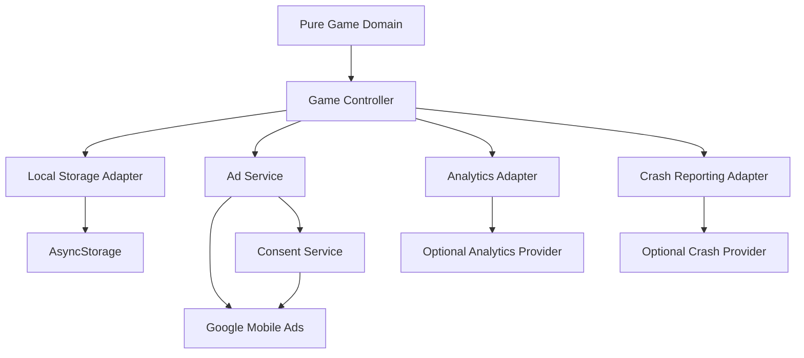

# BlastDown — Backend Design

**Document:** `BACKEND_DESIGN.md`
**Product:** BlastDown
**Version:** 1.0 Draft
**Status:** For Product Owner Review
**Primary platform:** Android
**Related documents:** `PRD.md`, `TECHNICAL_DESIGN.md`, `APP_FLOW.md`, `UI_UX_BRIEF.md`

## A-04 V1 Scope Lock

V1 is local-first and requires no custom backend. Current persistent behavior
supports active-run recovery, best score/statistics, settings, tutorial state,
and consent-related configuration. Current monetization supports only rewarded
Freeze and Defuse. Bolts, theme economy, Double Bolts, rewarded Revive, and
interstitials are excluded from current persistence, analytics, and ad-service
requirements. Deprecated fields remain parseable only to avoid invalidating
older local records.

---

# 1. Purpose

This document defines BlastDown's data and service architecture.

It answers:

- What data exists?
- Where is that data stored?
- How is it structured?
- Which parts are authoritative?
- Who or what may access each data category?
- What APIs exist?
- Is there a custom backend?
- How do authentication and authorization work?
- What information may leave the device?
- How are advertisements, analytics, consent, and crash reporting integrated?
- How are local data migrations handled?
- How are failures handled?
- When would BlastDown actually need a backend later?

For V1, BlastDown is intentionally a **local-first application with no custom application backend**.

---

# 2. V1 Backend Decision

BlastDown V1 will not operate a BlastDown-owned backend.

Therefore V1 has:

```text
NO application server
NO application database server
NO REST API
NO GraphQL API
NO WebSocket server
NO authentication server
NO user-account database
NO cloud save
NO server leaderboard
NO multiplayer server
```

The game engine runs entirely on the player's device.

---

# 3. Why V1 Does Not Need a Backend

The core BlastDown product consists of:

- local block-placement gameplay;
- local deterministic game state;
- move-based timers;
- local scoring;
- local best score;
- local preferences;
- rewarded advertisements;
- optional analytics;
- optional crash reporting.

None of these require a BlastDown-owned server to function.

Adding a backend in V1 would increase:

- implementation complexity;
- security obligations;
- privacy obligations;
- operational cost;
- failure modes;
- release time;
- testing burden;

without materially improving the core gameplay hypothesis.

---

# 4. Backend Principle

The central rule is:

> **BlastDown gameplay must remain functional when every network-dependent service is unavailable.**

The following must work offline:

- creating a game;
- placing pieces;
- clearing lines;
- timers;
- explosions;
- rubble;
- scoring;
- pause/resume;
- best score;
- settings;
- active-run persistence;
- restart;
- game over.

Only optional network-dependent features may become unavailable.

---

# 5. System Data Architecture



The device remains the authoritative source for V1 gameplay state.

---

# 6. Data Classification

BlastDown V1 data falls into six categories.

```text
1. Active gameplay data
2. Player preference data
3. Local progression/statistics
4. Advertising/consent state
5. Analytics data
6. Crash/diagnostic data
```

These categories have different storage and access requirements.

---

# 7. Authoritative Gameplay Data

During an active run, the authoritative gameplay state is:

```text
GameState
```

It exists in application memory while gameplay is active.

A serialized version is also saved locally for recovery.

The game domain—not the UI, renderer, audio system, or ad SDK—is the authority for gameplay.

---

# 8. GameState

Representative structure:

```ts
type GameState = {
  version: number;

  seed: string;
  rngState: number;

  turn: number;

  grid: GridCell[][];
  hand: HandPiece[];

  activeTimers: Record<string, ActiveTimedPiece>;

  score: number;
  combo: number;
  bestCombo: number;

  linesCleared: number;
  piecesPlaced: number;
  piecesDefused: number;
  explosions: number;
  rubbleCleared: number;

  freezeTurnsRemaining: number;

  rewardedFreezeUses: number;
  rewardedDefuseUses: number;

  reviveUsed?: boolean; // deprecated compatibility marker; not current behavior

  status: GameStatus;

  startedAt: number;
  lastUpdatedAt: number;
};
```

The production type must conform to the approved document hierarchy. Any
architecture-affecting evolution must be surfaced and recorded rather than
silently treating existing code as product authority.

---

# 9. Grid Data

Representative cell model:

```ts
type GridCell =
  | {
      kind: "empty";
    }
  | {
      kind: "timed";
      pieceInstanceId: string;
      colorId: string;
    }
  | {
      kind: "normal";
      colorId: string;
    }
  | {
      kind: "rubble";
      explosionId: string;
    };
```

The grid contains gameplay state only.

It must not contain:

- animation progress;
- Skia objects;
- sound players;
- UI references;
- advertisement objects;
- analytics state.

---

# 10. Active Timed Piece

Representative structure:

```ts
type ActiveTimedPiece = {
  id: string;
  shapeId: string;
  remainingTurns: number;
  placedOnTurn: number;
  colorId: string;
};
```

Countdowns are placement-based.

No server timestamp is required.

---

# 11. Hand Piece

Representative structure:

```ts
type HandPiece = {
  handId: string;
  shapeId: string;
  colorId: string;
};
```

The hand is stored as part of the active run so that restoring the game does not regenerate different pieces.

---

# 12. Deterministic Random State

The active run must persist:

```text
seed
rngState
```

This allows deterministic restoration.

Restoring an active run must not generate a new random sequence accidentally.

---

# 13. Active Run Persistence Model

Recommended persisted object:

```ts
type PersistedActiveRun = {
  schemaVersion: number;
  savedAt: number;
  game: GameState;
};
```

The object should contain everything needed to recreate the exact logical run.

It should not include transient visual state.

---

# 14. What Is Not Persisted With the Active Run

Do not persist:

- active animations;
- praise text currently on screen;
- effect queue;
- Skia clock slots;
- particle positions;
- audio playback position for SFX;
- haptic state;
- currently open modal animation;
- React component state;
- renderer references.

These are reconstructed from the authoritative game state.

---

# 15. Active Run Save Events

Persist the active run:

```text
after every completed turn
when the app backgrounds
when the player pauses
before opening a rewarded ad
```

Saving before rewarded advertising protects the player's run if the OS kills the application while the ad is displayed.

---

# 16. Active Run Restoration

Restoration must reproduce:

- board;
- hand;
- timers;
- turn number;
- score;
- combo;
- statistics;
- power-up state;
- run seed;
- RNG state.

Do not modify timers based on:

```text
current timestamp - saved timestamp
```

because timers are based on successful placements, not real time.

---

# 17. Active Run State Lifecycle

```text
new run
   ↓
active
   ↓
saved repeatedly
   ↓
paused/backgrounded
   ↓
resumed
   ↓
game over
   ↓
finalized
   ↓
active-run record removed
```

A completed run must not remain restorable as an active run.

---

# 18. Local Settings Data

Representative settings structure:

```ts
type PlayerSettings = {
  schemaVersion: number;

  soundEnabled: boolean;
  musicEnabled: boolean;
  hapticsEnabled: boolean;
  reducedMotion: boolean;

  tutorialCompleted: boolean;
};
```

Additional approved settings may be added later.

---

# 19. Settings Defaults

Safe initial defaults should be explicitly defined.

Example:

```ts
const DEFAULT_SETTINGS = {
  soundEnabled: true,
  musicEnabled: true,
  hapticsEnabled: true,
  reducedMotion: false,
  tutorialCompleted: false,
};
```

Exact defaults remain product configuration.

---

# 20. Best Score Data

Core V1 best score is local.

Representative:

```ts
type BestScoreRecord = {
  schemaVersion: number;
  value: number;
  updatedAt: number;
};
```

No server verification is required because there is no public competitive leaderboard.

---

# 21. Lifetime Statistics

Optional local aggregate statistics may include:

```ts
type LifetimeStats = {
  schemaVersion: number;

  runsStarted: number;
  runsFinished: number;

  piecesPlaced: number;
  linesCleared: number;

  piecesDefused: number;
  explosions: number;
  rubbleCleared: number;

  bestCombo: number;
};
```

These are local convenience/analytics values.

They are not required to determine gameplay correctness.

---

# 22. Tutorial Data

At minimum:

```ts
type TutorialState = {
  schemaVersion: number;
  completed: boolean;
};
```

Optional:

```text
last completed step
tutorial version
```

only if the product needs resumable onboarding.

---

# 23. Deprecated Legacy Progression Data

Older specifications proposed:

- Bolts;
- theme unlocks;
- selected theme;
- Double Bolts.

These are excluded from V1 behavior. Existing schema fields may remain for
backward-safe parsing, but V1 must not earn, spend, display, select, or emit
analytics for them. New installations must not depend on them.

---

# 24. Local Storage Technology

V1 uses:

```text
AsyncStorage
```

behind a typed service abstraction.

Conceptual location:

```text
src/services/storage/
├── StorageService.ts
├── activeRunStorage.ts
├── progressStorage.ts
├── settingsStorage.ts
└── migrations/
```

---

# 25. StorageService Boundary

Example:

```ts
interface StorageService {
  get<T>(key: StorageKey): Promise<T | null>;

  set<T>(key: StorageKey, value: T): Promise<void>;

  remove(key: StorageKey): Promise<void>;
}
```

Production implementation may be more strongly typed than this generic example.

---

# 26. Recommended Storage Keys

Use centralized keys.

Example:

```ts
const STORAGE_KEYS = {
  activeRun: "blastdown.activeRun",
  settings: "blastdown.settings",
  bestScore: "blastdown.bestScore",
  lifetimeStats: "blastdown.lifetimeStats",
  tutorial: "blastdown.tutorial",
} as const;
```

Do not scatter arbitrary storage-key strings across screens.

---

# 27. Storage Schema Versioning

Every structured persisted record must contain:

```text
schemaVersion
```

Versioning allows code updates without corrupting existing installations.

---

# 28. Migration Model

Example:

```text
schema 1
  ↓
migration 1 → 2
  ↓
schema 2
```

Migrations must be:

- deterministic;
- idempotent where possible;
- testable;
- side-effect limited;
- backward-aware.

---

# 29. Migration Failure

If settings migration fails:

```text
fallback to safe defaults
```

where appropriate.

If active-run migration fails:

```text
reject invalid run
preserve unrelated data
continue to Home
```

Do not crash the application because one stored object cannot be restored.

---

# 30. Storage Corruption

Every load path should tolerate:

- malformed JSON;
- missing fields;
- unsupported schema;
- impossible values;
- partial writes;
- stale data.

Validation should occur at the storage/domain boundary.

---

# 31. Data Access Rules

| Data        |                    Domain |   Controller |                              UI |                  Renderer |                       Services |
| ----------- | ------------------------: | -----------: | ------------------------------: | ------------------------: | -----------------------------: |
| GameState   | Read/write through domain |          Yes |                            Read | Read derived presentation |                   Storage only |
| Grid        |                       Yes |          Yes |                            Read |                      Read |                             No |
| Timer state |                       Yes |          Yes |                            Read |                      Read | Analytics selected events only |
| Score       |                       Yes |          Yes |                            Read |                      Read |              Storage/analytics |
| Settings    |      No gameplay mutation |          Yes | Read/write through settings API |       Read relevant flags |                  Audio/Haptics |
| Active run  |          Produces content | Save/restore |               No direct storage |                        No |                        Storage |
| Ad state    |                        No |          Yes |                            Read |                        No |                      AdService |
| Consent     |                        No |          Yes |               Read where needed |                        No |                 ConsentService |
| Analytics   |    Emits facts indirectly |          Yes |        No direct provider calls |                        No |               AnalyticsService |

---

# 32. Domain Access Rule

The domain may receive approved values as function/action inputs.

The domain must not import:

```text
AsyncStorage
Google Mobile Ads
analytics SDK
crash SDK
React
Expo Router
Skia
expo-audio
```

---

# 33. UI Data Access Rule

Screens and components should not directly read arbitrary storage keys.

Preferred:

```text
UI
↓
controller / hook
↓
typed service
↓
storage
```

This keeps storage structure replaceable and testable.

---

# 34. Renderer Data Access

Renderers may receive:

- board state;
- timer presentation;
- drag state;
- effect sequences;
- visual configuration.

Renderers must not:

- write storage;
- call ads;
- send analytics;
- update best score;
- grant power-ups.

---

# 35. V1 Network API

BlastDown owns no network API in V1.

Therefore:

```text
BlastDown REST endpoints: none
BlastDown GraphQL endpoints: none
BlastDown WebSockets: none
```

---

# 36. Internal Application APIs

Although there is no server API, BlastDown has internal typed service APIs.

These include:

```text
StorageService
AdService
ConsentService
AnalyticsService
AudioService
HapticsService
```

These are **application interfaces**, not internet endpoints.

---

# 37. AdService API

Representative:

```ts
interface AdService {
  preloadRewarded(placement: RewardedPlacement): Promise<void>;

  showRewarded(
    placement: RewardedPlacement,
  ): Promise<"earned" | "closed" | "unavailable" | "error">;
}
```

Interstitial methods are not part of the V1 service interface.

---

# 38. Rewarded Placement Identifiers

Possible approved V1 rewarded placements:

```text
rewarded_freeze
rewarded_defuse
```

Do not create arbitrary placement identifiers in screens.

Centralize them in monetization configuration.

---

# 39. Reward Authority

The ad network determines whether the ad reward condition was earned.

The BlastDown domain determines what the reward does.

Example:

```text
Ad SDK
→ earned

AdService
→ normalized "earned"

Controller
→ dispatch FREEZE reward action

Domain
→ authoritative updated GameState
```

The ad SDK never mutates `GameState` directly.

---

# 40. Reward Idempotency

One rewarded advertisement must result in at most one game reward.

The controller must protect against:

- duplicate callbacks;
- lifecycle re-entry;
- repeated close events;
- screen rerender;
- ad callback arriving after navigation.

---

# 41. Pending Reward State

Where necessary, represent an in-flight reward request explicitly.

Example:

```ts
type PendingReward = {
  requestId: string;
  placement: RewardedPlacement;
  startedAt: number;
};
```

This is application control state, not domain gameplay state.

It should exist only as long as needed to safely resolve the request.

---

# 42. Do Not Persist Earned Reward Optimistically

Do not apply:

```text
Freeze
Defuse
Revive
```

simply because an advertisement started.

Apply only after an authoritative earned result.

---

# 43. ConsentService

Representative abstraction:

```ts
interface ConsentService {
  initialize(): Promise<void>;

  requestIfRequired(): Promise<"resolved" | "not-required" | "unavailable" | "error">;

  canRequestAds(): boolean;

  showPrivacyOptions?(): Promise<void>;
}
```

Exact API should follow the actual integration.

---

# 44. Consent Data Ownership

Do not duplicate the consent SDK's entire internal state inside custom storage.

Persist only application-level values that are actually necessary.

The consent SDK remains authoritative for its own consent state.

---

# 45. Advertising Data Flow

```text
Player taps rewarded action
        ↓
BlastDown persists run
        ↓
AdService
        ↓
Google Mobile Ads SDK
        ↓
Google advertising infrastructure
        ↓
result returned
        ↓
BlastDown normalizes result
        ↓
Domain reward action if earned
```

---

# 46. Ad Data Minimization

BlastDown should not intentionally send gameplay-board contents to the advertising provider.

Only information required by the advertising SDK/configuration should leave the application through that integration.

---

# 47. AnalyticsService

Analytics must be provider-independent.

Representative:

```ts
interface AnalyticsService {
  track(event: AnalyticsEvent): void | Promise<void>;

  setEnabled?(enabled: boolean): void | Promise<void>;
}
```

Analytics failure must never block gameplay.

---

# 48. Analytics Event Model

Prefer typed events.

Example:

```ts
type AnalyticsEvent =
  | {
      name: "run_started";
      seed: string;
    }
  | {
      name: "line_clear";
      lines: number;
    }
  | {
      name: "piece_defused";
      remainingTurns: number;
    }
  | {
      name: "explosion_occurred";
      rubbleCreated: number;
    }
  | {
      name: "run_finished";
      summary: RunSummary;
    };
```

The final analytics contract should be documented separately if/when the provider is selected.

---

# 49. Analytics Data Minimization

Do not include:

- player name;
- email;
- phone number;
- contacts;
- exact location;
- free-text user input;
- advertising secrets;
- unnecessary device identifiers.

BlastDown V1 has no product reason to collect those fields.

---

# 50. Run Summary Analytics

A run summary may include:

```ts
type RunSummary = {
  durationMs: number;

  finalScore: number;
  turnCount: number;

  piecesPlaced: number;
  linesCleared: number;

  bestCombo: number;

  piecesDefused: number;
  explosions: number;
  rubbleCleared: number;

  rewardedActionsUsed: number;

  endReason: string;

  runSeed: string;
  appVersion: string;
};
```

Only include fields that are needed for product analysis.

---

# 51. High-Frequency Analytics Are Prohibited

Do not remotely track:

- every board-cell render;
- every animation frame;
- every glow update;
- every particle;
- every drag coordinate;
- every Reanimated update.

This creates unnecessary cost and privacy/performance overhead.

---

# 52. Crash Reporting

A production crash provider may receive:

- stack traces;
- application version;
- platform/OS information;
- technical crash metadata.

Do not intentionally attach complete active board state or unrelated personal information unless explicitly justified and reviewed.

---

# 53. Crash Breadcrumbs

Useful breadcrumbs may include:

```text
game started
turn completed
ad flow started
reward earned
renderer selected
app backgrounded
```

Avoid sensitive or excessively verbose state dumps.

---

# 54. Authentication

BlastDown V1 has:

```text
NO USER AUTHENTICATION
```

There is no:

- username;
- password;
- email login;
- social login;
- OTP;
- access token;
- refresh token;
- account session.

---

# 55. Authorization

Because there is no BlastDown backend and no account model:

```text
NO PLAYER ROLE-BASED AUTHORIZATION
```

All normal V1 gameplay occurs locally.

---

# 56. Development Authorization

Development-only tools are not protected through user accounts.

They are protected by:

```text
development build conditions
compile/bundle exclusion
feature configuration
```

Production users must not be able to navigate into development diagnostics merely through hidden UI gestures.

---

# 57. Local Data Trust

Locally persisted data is not considered tamper-proof.

A sufficiently motivated user may modify:

- score;
- settings;
- saved run;
- local statistics.

That is acceptable for the current V1 because there is no global competitive system.

---

# 58. Why Local Scores Are Not Secure

Any score calculated and stored solely on the client can ultimately be manipulated by someone controlling the client.

Therefore BlastDown must not later expose local score values directly as trusted competitive leaderboard results.

---

# 59. Security Boundary

V1 security protects:

- build credentials;
- production configuration;
- release signing material;
- user privacy;
- ad reward correctness;
- dependency integrity;
- local-state stability.

It does not attempt to provide anti-cheat-grade local gameplay security.

---

# 60. Secrets

Never store private secrets in:

```text
source control
AsyncStorage
EXPO_PUBLIC_* variables
client JavaScript bundles
```

Examples of private material:

- service-account credentials;
- private backend API secrets;
- signing keys;
- keystore passwords;
- private certificates.

---

# 61. Public Client Configuration

Some values necessarily exist in the application bundle, for example:

- advertising app identifiers;
- advertising unit identifiers;
- public feature flags;
- public policy URLs.

These are configuration values, not server authentication secrets.

---

# 62. Environment Separation

At minimum maintain:

```text
development
preview/internal QA
production
```

Different environments may use:

- test ad identifiers;
- production ad identifiers;
- different analytics modes;
- diagnostics enabled/disabled.

---

# 63. Test Advertising

Development and automated testing should never accidentally use live production rewarded advertisements.

Use:

- SDK test identifiers;
- mock `AdService`;
- explicit development configuration.

---

# 64. Production Advertising Configuration

Production requires owner-provided/configured:

- AdMob application identifier;
- rewarded unit identifiers;
- consent configuration;
- privacy policy;
- appropriate audience classification.

Do not hardcode temporary production credentials into architecture documents.

---

# 65. Privacy Policy Data Disclosure

The final privacy policy and Play Store Data Safety disclosure must reflect the actual production providers.

Do not claim:

```text
"no data collected"
```

without reviewing what the selected:

- ad SDK;
- analytics SDK;
- crash SDK;
- consent SDK

actually collect.

---

# 66. Data Access by Actor

| Actor / System          | Access                                           |
| ----------------------- | ------------------------------------------------ |
| Player                  | Interacts with their own local gameplay/settings |
| Domain engine           | Gameplay state only                              |
| Application controller  | Gameplay + services orchestration                |
| Renderer                | Read-only presentation state                     |
| AsyncStorage adapter    | Approved local persisted records                 |
| AudioService            | Audio settings + presentation events             |
| HapticsService          | Haptic preference + presentation events          |
| AdService               | Ad placement and lifecycle only                  |
| ConsentService          | Consent/ad eligibility state                     |
| AnalyticsService        | Approved typed telemetry                         |
| Crash provider          | Approved technical diagnostics                   |
| Google Mobile Ads       | SDK-required advertising data                    |
| BlastDown custom server | None — does not exist in V1                      |

---

# 67. Personal Data

BlastDown V1 does not require the player to provide:

```text
name
email
phone
address
birthday
location
profile photo
contacts
```

Do not add collection of these fields without a product requirement and privacy review.

---

# 68. Data Deletion

Because core player data is local:

```text
uninstalling the app
```

typically removes local application data according to platform behavior.

Where settings include a reset option in the future, it should clearly distinguish:

```text
reset active game
reset settings
reset all local progress
```

Do not add destructive reset options casually.

---

# 69. Remote Analytics Deletion

If the selected analytics provider creates requirements around user deletion or identifiers, those obligations must be documented when the provider is chosen.

No unsupported deletion guarantees should be made before then.

---

# 70. Local Data Backup

V1 does not promise cloud backup or cloud synchronization.

If Android platform backup behavior causes AsyncStorage data to restore automatically, this should be tested and documented rather than treated as BlastDown cloud save.

---

# 71. Multi-Device State

Not supported in V1.

A player using two devices may have:

```text
different best scores
different active runs
different settings
```

This is expected under the local-first architecture.

---

# 72. Concurrent Writes

Although V1 has one local user, storage calls can overlap asynchronously.

The application should avoid conflicting writes to the same logical record.

For active runs:

```text
newer authoritative turn
must not be overwritten
by an older delayed save
```

Use serialized save operations or equivalent ordering protection if needed.

---

# 73. Write Ordering

A safe pattern:

```text
turn N resolves
   ↓
save N queued

turn N+1 resolves
   ↓
save N+1 queued after N
```

Avoid unconstrained parallel writes of complete active-run snapshots.

---

# 74. Atomicity

AsyncStorage is not a transactional relational database.

Keep related state together when atomic logical restoration matters.

For example, active gameplay should preferably be stored as one coherent versioned snapshot rather than many independently updated keys.

---

# 75. Best Score Update

When a run produces a new record:

```text
new score > stored best
```

then:

```text
update in memory
→ persist best score
```

A storage failure must not crash Results.

---

# 76. Settings Update

Recommended flow:

```text
player toggles setting
      ↓
update application state
      ↓
persist setting
      ↓
dependent service reacts
```

Example:

```text
Music OFF
→ AudioService stops/suppresses music
```

---

# 77. Storage Write Failure

If a write fails:

- gameplay continues;
- preserve current in-memory state;
- retry only when safe;
- report failure through diagnostics/crash telemetry where appropriate.

Do not show repeated blocking modals after every turn.

---

# 78. Storage Read Failure

If optional records fail:

```text
settings → safe defaults
best score → default value
lifetime stats → empty aggregate
```

For active run:

```text
validate
→ migrate if possible
→ otherwise reject safely
```

---

# 79. API Error Model

Internal service interfaces should normalize provider-specific failures.

Example ad result:

```ts
type RewardedResult = "earned" | "closed" | "unavailable" | "error";
```

Screens should not need to understand dozens of Google SDK error codes.

Provider-specific details may still be logged for diagnostics.

---

# 80. Fail-Open Policy

Optional services use a fail-open philosophy.

| Service                | Failure Result                 |
| ---------------------- | ------------------------------ |
| Analytics              | Gameplay continues             |
| Crash reporting        | Gameplay continues             |
| Audio                  | Gameplay continues silently    |
| Haptics                | Gameplay continues             |
| Ads                    | Reward unavailable             |
| Consent                | Core gameplay continues        |
| Storage settings       | Use in-memory/defaults         |
| Active-run persistence | Continue current in-memory run |

---

# 81. External Service Availability

The application must assume:

```text
network services can disappear at any time
```

Never build gameplay logic requiring a successful:

- ad request;
- analytics request;
- crash-report upload;
- consent refresh.

---

# 82. Timeout Behavior

Third-party network operations must not block the game indefinitely.

Rewarded advertising should eventually normalize to:

```text
unavailable
or
error
```

if the SDK cannot provide an ad.

---

# 83. Retry Behavior

Retries should be controlled by the relevant SDK/service.

Do not create aggressive application-level retry loops.

Especially avoid:

```text
retry every second forever
```

---

# 84. Data Retention

Local records should exist only as long as useful.

### Active run

Delete/finalize when the run is completed or intentionally discarded.

### Settings

Retain until reset/uninstall.

### Best score

Retain until reset/uninstall.

### Lifetime stats

Retain while the feature remains useful.

Remote provider retention depends on final provider configuration and privacy policy.

---

# 85. Data Export

V1 does not require a user-facing gameplay data export.

If legal/product requirements later require export of remote account data, that would be another reason to introduce an account/backend design.

---

# 86. Rate Limiting

BlastDown has no owned public network API, so server rate limiting is not required.

Client-side throttling is still needed for:

- repeated ad button taps;
- analytics storms;
- audio events;
- haptic events.

---

# 87. Duplicate Ad Requests

While one rewarded request is active:

```text
additional taps
→ ignored / disabled
```

Do not launch multiple rewarded ads for the same user intent.

---

# 88. Analytics Queueing

The analytics adapter may buffer or allow the provider to queue events.

Gameplay must not wait for event transmission.

Do not create an unbounded custom offline analytics queue.

---

# 89. Analytics Offline Behavior

When offline:

```text
provider may queue
or
event may be dropped
```

Either outcome is acceptable if documented.

Gameplay must not retry synchronously.

---

# 90. Future Backend Trigger: Accounts

A backend becomes necessary if BlastDown introduces:

- player accounts;
- account recovery;
- cross-device identity;
- cloud progression.

This would require a new authentication design.

---

# 91. Future Backend Trigger: Cloud Save

Cloud save requires:

```text
authenticated identity
remote persistence
sync/version strategy
conflict resolution
migration strategy
offline reconciliation
```

Do not bolt cloud saving directly onto the current AsyncStorage schema.

---

# 92. Future Backend Trigger: Global Leaderboard

A global leaderboard requires:

- server API;
- authenticated or anonymous server identity;
- score submission;
- anti-cheat strategy;
- replay/run validation;
- rate limiting;
- moderation/abuse controls where applicable.

Local best score cannot be trusted as a server leaderboard submission.

---

# 93. Future Backend Trigger: Daily Challenges

A purely deterministic daily challenge could initially be generated from a date-derived seed.

A backend becomes useful if the product needs:

- globally identical schedule independent of client clock;
- challenge configuration;
- remote results;
- rankings;
- event analytics/control.

---

# 94. Future Backend Trigger: Remote Configuration

Remote balance/configuration may eventually justify backend or managed remote-config services.

However, V1 balance remains application-controlled.

Do not introduce remote gameplay rule changes before deterministic testing and versioning are designed.

---

# 95. Future Backend Trigger: Purchases

If paid purchases/subscriptions are introduced, server-side receipt validation may become appropriate depending on the commercial/security model.

This is outside current V1 scope.

---

# 96. Future Backend Trigger: Social Features

Friends, profiles, sharing histories, chat, multiplayer, or user-generated content require a fundamentally different backend and moderation architecture.

None belong in current V1.

---

# 97. Future Authentication Options

No authentication approach is approved because V1 has no accounts.

If required later, evaluate independently:

```text
anonymous device account
Google sign-in
Apple sign-in
email/password
magic link
```

Do not implement speculative authentication infrastructure now.

---

# 98. Future Authorization

If user accounts and backend resources are introduced, authorization must follow server-side ownership.

Conceptually:

```text
user A
can access
user A resources

user A
cannot access
user B resources
```

Client-side hiding is not authorization.

---

# 99. Future API Versioning

No BlastDown remote API exists in V1.

If one is introduced later, use explicit versioning and backwards-compatible mobile rollout planning because installed app versions cannot be updated instantly.

---

# 100. Future Database Selection

No database technology should be selected until backend requirements exist.

Do not pre-commit V1 to:

```text
PostgreSQL
Firebase
Supabase
DynamoDB
MongoDB
```

without an actual product requirement.

The current correct database decision is:

```text
No server database.
```

---

# 101. Future Backend Hosting

Likewise, V1 does not require:

```text
AWS
Azure
Google Cloud
Firebase backend
Supabase backend
custom VPS
```

EAS Build is build infrastructure, not the BlastDown application backend.

---

# 102. Backup and Disaster Recovery

There is no BlastDown server dataset to back up in V1.

Repository and release infrastructure should still protect:

- source code;
- build configuration;
- signing credentials;
- store assets;
- licensing records.

Player-local run data is not centrally recoverable.

---

# 103. Backend Monitoring

V1 does not require server uptime monitoring because no BlastDown server exists.

Monitor instead where available:

- crash-free sessions;
- ANRs;
- ad errors;
- rewarded completion;
- application startup;
- storage migration failures.

---

# 104. Data Privacy Review Before Release

Before production:

1. identify every third-party SDK actually included;
2. document what each SDK may collect;
3. configure consent correctly;
4. finalize privacy policy;
5. complete Google Play Data Safety;
6. remove unused SDKs;
7. ensure analytics events contain no unnecessary personal data;
8. confirm development/test identifiers are not incorrectly used in production.

---

# 105. Backend Testing Requirements

Automated tests should cover:

### Storage

- default settings;
- save/load settings;
- best-score persistence;
- active-run save;
- active-run restore;
- schema migrations;
- corrupt run handling;
- unsupported schema handling;
- ordered writes.

### Ads

- earned reward;
- closed without reward;
- unavailable;
- error;
- duplicate callback;
- repeat tap protection;
- exactly-once reward.

### Consent

- required;
- not required;
- unavailable;
- failure without gameplay block.

### Analytics

- correct event mapping;
- run summary;
- provider failure;
- no gameplay interruption.

---

# 106. Backend Integration Test Scenarios

At minimum:

```text
1. Start run → save → terminate → restore exact run
2. Save timers → wait outside app → restore unchanged
3. Corrupt active-run JSON → app still launches
4. Upgrade stored schema → migration succeeds
5. Rewarded Freeze earned → applies exactly once
6. Freeze ad closes early → no change
7. Rewarded Defuse earned → applies exactly once
8. Duplicate reward callback → one reward
9. Offline → game remains fully playable
10. Analytics provider throws → run continues
11. Storage write fails → current turn remains playable
12. Completed run → active-run record cannot resume
```

---

# 107. Physical Device Service Tests

On real Android hardware verify:

- cold launch offline;
- active-run background/resume;
- process kill and restoration;
- successful rewarded ad;
- ad unavailable;
- ad close without reward;
- ad error;
- background during ad;
- consent flow;
- privacy-options flow where applicable;
- production-like release build.

---

# 108. Backend Definition of Done

V1 backend/data architecture is complete when:

### Local gameplay

- no network is required;
- active runs restore exactly;
- timers do not change with elapsed wall time;
- best score persists;
- settings persist.

### Storage

- records are versioned;
- migrations are tested;
- corrupt data fails safely;
- completed runs are not restored.

### Ads

- provider is isolated behind `AdService`;
- rewards are applied exactly once;
- ad failure does not modify gameplay;
- offline behavior is safe.

### Consent

- production flow is configured;
- privacy options behave correctly;
- failure cannot lock gameplay.

### Analytics

- provider is behind an adapter;
- events contain only approved fields;
- provider failure is non-blocking.

### Security

- no secrets are committed;
- AsyncStorage contains no credentials;
- development services use test configuration;
- production configuration is validated.

### Scope

- no speculative backend;
- no account system;
- no cloud sync;
- no leaderboard infrastructure.

---

# 109. Open Backend Decisions

Before production release, confirm:

1. Final analytics provider.
2. Final crash-reporting provider.
3. Final production AdMob configuration.
4. Final consent configuration.
5. Privacy policy URL.
6. Google Play audience classification.
7. Exact analytics retention/configuration.
8. Rewarded Revive is excluded from V1.
9. Interstitial ads are excluded from V1.
10. Whether lifetime statistics need their own persistent record.
11. Whether Android automatic backup should be explicitly disabled, accepted, or tested/documented.
12. Older Bolts/theme progression is excluded; deprecated fields are parse-only.

---

# 110. Relationship to Engineering Plan

`ENGINEERING_PLAN.md` should translate this backend design into tasks such as:

```text
storage schema audit
migration tests
active-run recovery tests
reward idempotency verification
consent device QA
analytics provider integration
privacy review
production configuration validation
```

The Engineering Plan must not add a custom backend simply because a “backend phase” exists.

---

# 111. Final Backend Principle

The most important backend decision in BlastDown V1 is the decision **not to build one unnecessarily**.

The correct architecture is:

> **Gameplay and player state are local. Third-party network services are optional adapters. The core game remains playable when the network disappears.**

A custom backend should only be introduced when a future product requirement genuinely requires trusted shared state, identity, synchronization, or online competition.
