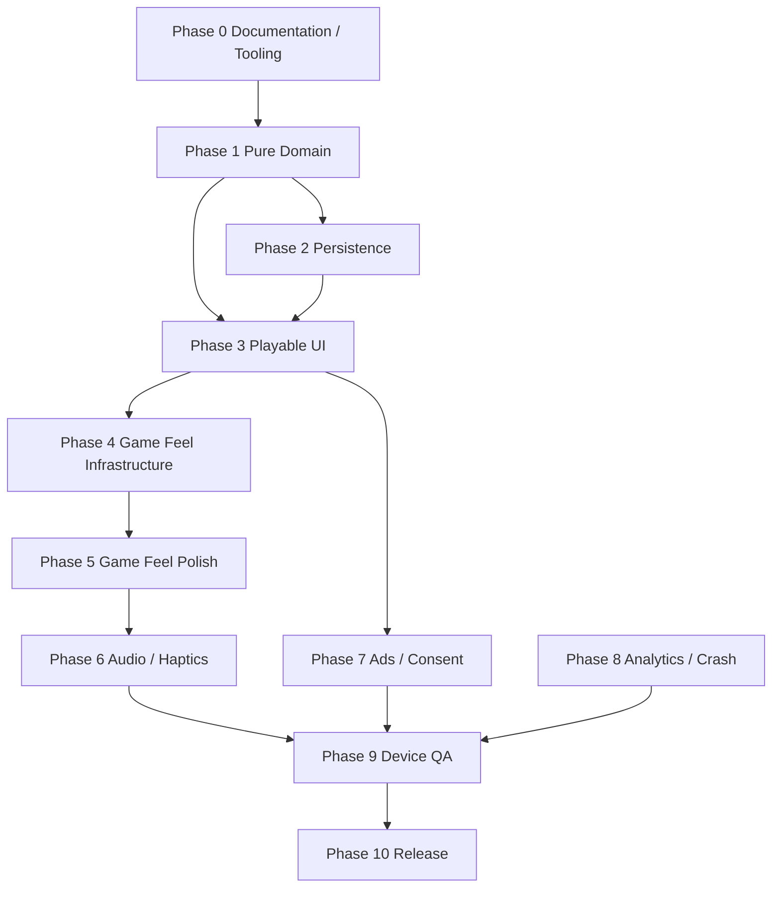

# BlastDown — Engineering Plan

**Document:** `ENGINEERING_PLAN.md`
**Product:** BlastDown
**Version:** 1.0 Draft
**Status:** For Product Owner Review
**Primary platform:** Android
**Development model:** Codex is the sole engineering agent; approved product documents direct the build
**Related documents:** `PRD.md`, `TECHNICAL_DESIGN.md`, `APP_FLOW.md`, `UI_UX_BRIEF.md`, `BACKEND_DESIGN.md`, `BUILD_SPEC.md`

## A-04 V1 Scope Lock

Build only the locked V1 defined in the PRD. Production work includes the core
endless game, active-run/session flow, tutorial and canonical screens,
rewarded Freeze/Defuse, audio/haptics/accessibility, consent/privacy,
analytics/crash reporting, production rewarded-ad support, and Android-first
release work. Bolts, Themes/economy, Double Bolts, rewarded Revive,
interstitials, and the other PRD non-goals are excluded. Legacy data fields may
remain parseable but must not create current product behavior.

---

# 1. Purpose

This document defines how BlastDown should actually be built and finished.

It answers:

- what should be built first;
- what each task depends on;
- which agent owns each task;
- which files each task is expected to touch;
- how each task should be tested;
- what counts as complete;
- when physical-device validation is mandatory;
- when product work may advance to the next phase;
- what should not be built yet.

The plan is intended to prevent:

- feature creep;
- architecture drift;
- UI code duplicating gameplay logic;
- effects being added before effect delivery is reliable;
- audio being added before event semantics are stable;
- production monetization being configured before core gameplay is validated;
- agents editing the same files simultaneously.

---

# 2. Execution Principle

BlastDown should be built from the inside out:

```text
rules
→ deterministic engine
→ persistence
→ playable UI
→ reliable feedback pipeline
→ game feel
→ audio
→ monetization
→ analytics
→ release QA
```

The project should not be developed in the opposite order.

For example:

```text
celebration text
→ particles
→ music
→ ads
→ gameplay bugs
```

is the wrong sequence.

---

# 3. Source-of-Truth Order

When instructions conflict, use this priority:

```text
1. Approved PRD
2. Approved Technical Design
3. Approved App Flow
4. Approved UI/UX Brief
5. Approved Backend Design
6. Approved Engineering Plan
7. GAME_RULES.md
8. docs/DECISIONS.md
9. BUILD_SPEC.md, as historical context only where not superseded
10. Current task prompt
11. Existing implementation
```

If current implementation conflicts with an approved document:

- do not silently preserve the implementation;
- do not silently rewrite the document;
- surface the conflict;
- record the approved resolution in `docs/DECISIONS.md`.

---

# 4. Engineering Responsibility

## 4.1 Codex

Codex is the sole engineering agent for the current build and is responsible
for implementation, integration, verification, documentation consistency, and
release preparation across:

- architecture;
- domain rules;
- game reducer;
- gameplay contracts;
- persistence schema;
- seeded generation;
- timer resolution;
- explosions;
- scoring;
- service interfaces;
- effect/event architecture;
- audio architecture;
- monetization rules;
- analytics schema;
- native integration decisions;
- dependency changes;
- release integration;
- final review.

Product direction remains owned by the approved documents. Codex must surface
architecture-affecting changes and may not silently change product direction.

---

# 5. Execution Scope

Codex implements:

- React Native screens;
- responsive layout;
- components;
- board presentation;
- tray presentation;
- gestures;
- placement preview rendering;
- Skia/Reanimated visual effects;
- timer presentation;
- praise presentation;
- settings UI;
- accessibility;
- audio wiring after the audio contract exists;
- Android layout fixes;
- visual polish;
- component tests.

Architecture, gameplay-rule, persistence-schema, monetization, analytics, and
dependency changes require explicit task authorization and a recorded decision.

---

# 6. Single-Writer Rule

Only one active writer may own a file/module at a time.

Each delegated task must specify:

```text
TASK ID
OBJECTIVE
READ FIRST
ALLOWED FILES
FORBIDDEN FILES
DEPENDENCIES
REQUIREMENTS
ACCEPTANCE CRITERIA
TESTS
RETURN FORMAT
```

Codex must inspect the full diff before committing work.

---

# 7. Task Definition

A task is not:

```text
"Improve the game"
"Make effects better"
"Fix UI"
"Add sound"
```

A task should be bounded.

Example:

```text
TASK: GAMEFEEL-002

OBJECTIVE:
Add pre-clear row/column preview for the currently valid drag anchor.

ALLOWED:
src/components/GameBoard/**
src/rendering/cinematic/**
src/domain/selectors.ts
relevant tests

FORBIDDEN:
timer rules
explosion rules
scoring
ads
persistence schema
```

---

# 8. Task Completion Standard

No engineering task is complete merely because:

```text
the code compiles
or
the screen looks correct once
```

A completed task requires:

1. implementation;
2. automated tests where applicable;
3. typecheck;
4. lint;
5. formatting;
6. relevant integration tests;
7. documentation update if behavior/architecture changed;
8. physical-device QA where native/rendering/audio behavior is involved;
9. commit;
10. concise implementation report.

---

# 9. Required Verification Commands

Applicable work should run:

```bash
npm run typecheck
npm run lint
npm run format:check
npm run test
npm run test:coverage
npx expo-doctor
```

For sensitive changes, run the full test suite more than once using different randomization seeds where supported.

---

# 10. Additional Verification by Area

## Domain

Require:

- unit tests;
- deterministic fixtures;
- red-before-fix regression test for bugs.

## UI

Require:

- component tests;
- responsive-device inspection.

## Renderer

Require:

- renderer contract tests;
- Android export;
- feature-flag variants;
- physical Android test.

## Audio

Require:

- automated event mapping tests;
- real-device listening.

## Ads

Require:

- test-ad physical-device flow;
- exactly-once reward tests.

## Persistence

Require:

- save/restore;
- corruption;
- migration;
- process restart tests.

---

# 11. Red-Before-Fix Policy

For any reproducible defect:

```text
bug exists
↓
write/modify regression test
↓
confirm RED
↓
implement fix
↓
confirm GREEN
↓
run broader suite
```

A test that passes before the fix is not sufficient evidence that it protects against the defect.

---

# 12. Test the Actual Failure Layer

Tests should operate at the layer where the defect exists.

Examples:

### Bundler defect

Use:

```text
Metro/Babel transform
or
production bundle inspection
```

not merely source-string matching.

### Effect concurrency defect

Test:

```text
multiple actual EffectSequence objects
through renderer contract
```

not only queue helper functions.

### Persistence defect

Perform:

```text
serialize
→ reload
→ migrate/restore
```

not merely object construction.

---

# 13. Full Build Dependency Map



---

# 14. Current Project Position

At the time this plan is drafted, BlastDown is no longer at Phase 0.

The project already has substantial implementation in:

- domain gameplay;
- persistence;
- playable gameplay UI;
- fallback renderer;
- cinematic Skia renderer;
- event-driven effects;
- multi-effect queue;
- stable effect identity;
- cinematic animation-clock leasing;
- development effect harness;
- development diagnostics;
- static production bundle exclusion;
- rewarded-ad architecture;
- consent infrastructure.

The remaining work should therefore follow the **Current Execution Queue** later in this document rather than restarting completed phases.

---

# 15. Phase 0 — Documentation and Engineering Scaffold

**Owner:** Codex

## Tasks

```text
P0-001 Approve PRD
P0-002 Approve Technical Design
P0-003 Approve App Flow
P0-004 Approve UI/UX Brief
P0-005 Approve Backend Design
P0-006 Approve Engineering Plan
P0-007 Maintain agent compatibility instructions
P0-008 Maintain AGENTS.md
P0-009 Maintain TASKS.md
P0-010 Maintain DECISIONS.md
P0-011 Configure Graphify workflow
```

---

# 16. Phase 0 Dependencies

None.

---

# 17. Phase 0 Acceptance

Complete when:

- documentation exists;
- major product scope is explicit;
- architecture is explicit;
- sole-agent responsibility and product-document authority are explicit;
- repository verification scripts exist;
- Graphify/codebase investigation workflow is configured.

---

# 18. Phase 1 — Pure Gameplay Engine

**Owner:** Codex

The gameplay engine must be correct before presentation polish.

---

# 19. Phase 1 Tasks

```text
ENGINE-001 Board/grid types
ENGINE-002 Piece shapes
ENGINE-003 Seeded RNG
ENGINE-004 Hand generation
ENGINE-005 Placement validation
ENGINE-006 Placement application
ENGINE-007 Row detection
ENGINE-008 Column detection
ENGINE-009 Simultaneous clears
ENGINE-010 Timer assignment
ENGINE-011 Timer decrement
ENGINE-012 Natural defuse
ENGINE-013 Freeze behavior
ENGINE-014 Defuse power-up
ENGINE-015 Explosion resolution
ENGINE-016 Rubble
ENGINE-017 Scoring
ENGINE-018 Combo
ENGINE-019 Game-over detection
ENGINE-020 GameEvent output
```

---

# 20. Phase 1 Dependencies

Only Phase 0 architecture/game rules.

---

# 21. Phase 1 Tests

Required:

- valid placement;
- invalid placement;
- bounds;
- overlap;
- rows;
- columns;
- row + column simultaneously;
- timer assignment;
- newly placed timer not decremented immediately;
- existing timers decrement;
- timer-at-one rescue;
- Freeze;
- natural defuse;
- Defuse power-up;
- single explosion;
- simultaneous explosions;
- rubble behavior;
- deterministic seeded generation;
- game over;
- score;
- combo reset.

---

# 22. Phase 1 Definition of Done

Complete when:

```text
game can be simulated entirely
without React Native
```

and all gameplay rules are deterministic and covered.

---

# 23. Phase 2 — Persistence

**Owner:** Codex

---

# 24. Phase 2 Tasks

```text
DATA-001 StorageService
DATA-002 Storage keys
DATA-003 Versioned active run
DATA-004 Settings storage
DATA-005 Best-score storage
DATA-006 Active-run save
DATA-007 Active-run restore
DATA-008 Schema migration framework
DATA-009 Corrupt-data recovery
DATA-010 App background save
DATA-011 Save before rewarded ad
```

---

# 25. Phase 2 Dependencies

Requires stable Phase 1 `GameState`.

---

# 26. Phase 2 Tests

Test:

- exact run restoration;
- hand restoration;
- timer restoration;
- RNG restoration;
- background/relaunch;
- migration;
- malformed JSON;
- unsupported schema;
- completed run cannot resume;
- settings persistence.

---

# 27. Phase 2 Definition of Done

A run can be:

```text
played
→ saved
→ app terminated
→ restored
```

without logical state changing.

---

# 28. Phase 3 — Playable Application UI

**Owner:** Codex

---

# 29. Phase 3 Tasks

```text
UI-001 Home
UI-002 Gameplay screen
UI-003 Score header
UI-004 8×8 board
UI-005 Three-piece tray
UI-006 Piece selection
UI-007 Drag handling
UI-008 Placement ghost
UI-009 Invalid placement feedback
UI-010 Timer labels
UI-011 Pause
UI-012 Restart
UI-013 Game Over
UI-014 Results
UI-015 Settings
UI-016 Tutorial
UI-017 Active-run resume
```

---

# 30. Phase 3 Dependencies

Requires:

- placement engine;
- selectors;
- state controller;
- persistence.

---

# 31. Phase 3 Definition of Done

A player can:

```text
launch
→ start
→ place pieces
→ clear lines
→ manage timers
→ explode
→ reach Game Over
→ Play Again
```

through the actual UI.

---

# 32. Phase 4 — Game Feel Infrastructure

This phase establishes reliable presentation delivery before adding more effects.

**Owner:** Codex

---

# 33. Phase 4 Tasks

```text
FXINF-001 GameEvent presentation adapter
FXINF-002 EffectSequence contract
FXINF-003 Effect identity
FXINF-004 Effect priority
FXINF-005 Bounded queue
FXINF-006 Multi-effect rendering
FXINF-007 Independent completion
FXINF-008 Session isolation
FXINF-009 Cinematic clock leasing
FXINF-010 Effect harness
FXINF-011 Diagnostics
FXINF-012 Bundle exclusion tests
FXINF-013 Cinematic feature flag
FXINF-014 Fallback renderer contract
```

---

# 34. Phase 4 Reliability Requirements

The system must support:

```text
clear
+
defuse
+
explosion
```

without one effect replacing another.

Maximum live queue:

```text
6
```

---

# 35. Phase 4 Tests

Must include:

- two simultaneous effects;
- same-type effects with unique keys;
- independent progress;
- one effect completes while another remains;
- priority ordering;
- six effects accepted;
- seventh follows deterministic eviction;
- critical effect survives pressure;
- restart clears previous session;
- Home/unmount clears transient effects;
- fallback and cinematic contracts agree;
- flag OFF avoids Skia evaluation;
- flag OFF production bundle excludes cinematic tree;
- dev harness absent from production.

---

# 36. Phase 4 Definition of Done

Phase 4 is complete only when both automated testing **and physical Android testing** prove:

- accepted effects appear reliably;
- simultaneous effects remain independent;
- no survivor animation restarts;
- no stale effect appears after restart;
- no renderer crash;
- no progressive slowdown.

---

# 37. Phase 5 — Core Game Feel

Do not add all polish at once.

Implement in value order.

---

# 38. Phase 5A — Pre-Clear Preview

**Priority:** Highest

**Owner:** Codex

Task:

```text
GAMEFEEL-001
Pre-clear row/column preview
```

---

# 39. Pre-Clear Requirements

While dragging over a valid clear-producing anchor:

- highlight affected rows;
- highlight affected columns;
- support simultaneous row + column;
- stronger intersection;
- remove immediately when anchor changes;
- no gameplay mutation.

---

# 40. Pre-Clear Performance

Do not:

- recalculate every frame;
- create 64 animation drivers;
- duplicate line-clear rules in UI.

Compute when the logical anchor changes.

---

# 41. Pre-Clear Tests

Test:

- one row;
- one column;
- row + column;
- no preview for invalid placement;
- preview disappears;
- preview updates on new anchor;
- no mutation before drop;
- Reduced Motion retains static clarity.

---

# 42. Phase 5B — Line Clear Polish

Task:

```text
GAMEFEEL-002
Line-clear sweep and impact
```

Implement:

- flash;
- sweep;
- bounded breakup;
- score slam;
- haptic.

---

# 43. Phase 5C — Danger Lighting

Task:

```text
GAMEFEEL-003
Global dangerLevel
```

Input:

```text
lowest active timer
```

Output:

- board vignette;
- pulse speed;
- ambient color.

---

# 44. Phase 5D — Praise System

Task:

```text
GAMEFEEL-004
Praise semantics and renderer
```

Codex implements and verifies:

```text
trigger rules
tier rules
priority
```

Presentation work includes:

```text
visual component
animation
responsive behavior
```

---

# 45. Required Praise Semantics

```text
1 line        CLEAR / NICE
2 lines       DOUBLE
3 lines       TRIPLE BLAST
4+ lines      OVERLOAD

defuse 3+     DEFUSED
defuse 2      CLOSE ONE
defuse 1      CLUTCH!
```

Ordinary line clear must never produce `DEFUSED`.

---

# 46. Praise Tests

Test:

- correct mapping;
- one active phrase;
- higher tier replaces lower;
- same Tier 1 word does not repeat if shuffled behavior is retained;
- Reduced Motion retains readable text;
- actual defuse maps correctly.

---

# 47. Phase 5E — Explosion Polish

Task:

```text
GAMEFEEL-005
Explosion presentation
```

Implement only after ordinary clear and danger systems are stable.

---

# 48. Explosion Requirements

Possible presentation:

- flash;
- shockwave;
- group shake;
- rubble impact;
- bounded dust/debris;
- audio later.

Do not change explosion rules.

---

# 49. Phase 5F — Secondary Ambient Polish

After higher-value work:

```text
GAMEFEEL-006 Score slam
GAMEFEEL-007 Post-clear rim light
GAMEFEEL-008 Tray warning
GAMEFEEL-009 Optional idle breathing
```

Idle breathing is removed first if it costs measurable performance.

---

# 50. Phase 5 Definition of Done

Complete when:

- placement feels immediate;
- clear is predictable before release;
- one clear feels rewarding;
- multi-clear visibly escalates;
- danger is perceptible;
- defuse is semantically distinct;
- explosion is stronger than a clear;
- no meaningful input latency is introduced.

---

# 51. Phase 6 — Audio and Haptics

Audio begins only after `GameEvent` and praise semantics are stable.

**Owner:** Codex

---

# 52. Phase 6A — Audio Foundation

Tasks:

```text
AUDIO-001 AudioService
AUDIO-002 Audio manifest
AUDIO-003 Preload manager
AUDIO-004 SFX channel
AUDIO-005 Music channel
AUDIO-006 Settings integration
AUDIO-007 Lifecycle integration
AUDIO-008 Ad duck/pause integration
AUDIO-009 License inventory
```

---

# 53. Required Initial SFX

```text
ui tap
piece pickup
valid placement
invalid placement
line clear
multi clear
timer 2
timer 1
defuse
clutch
Freeze
explosion
rubble clear
reward earned
game over
new best
```

---

# 54. Phase 6B — Combo Pitch

Task:

```text
AUDIO-010 Combo pitch ladder
```

Rule:

```text
combo 1 = base
each next combo = +1 semitone
cap = +12
```

Reset on combo break.

---

# 55. Phase 6C — Gameplay Music

Task:

```text
AUDIO-011 Production gameplay loop
```

Requirements:

- licensed/original;
- seamless;
- no vocals;
- restrained;
- futuristic/electronic;
- does not obscure gameplay SFX.

---

# 56. Audio Licensing Gate

Before any downloaded/AI-generated production asset is committed, record:

```text
source
creator/provider
license
commercial-use right
attribution
acquisition date
modification
```

in:

```text
assets/licenses/AUDIO_LICENSES.md
```

---

# 57. Audio Tests

Automated:

- correct event-to-sound mapping;
- settings suppress channels;
- no duplicate sound for one event;
- combo reset;
- lifecycle pause/resume;
- ad duck/restore.

Physical:

- first sound has no noticeable delay;
- sounds are balanced;
- timer warnings readable on phone speaker;
- repeated clear sound is not irritating;
- explosion does not clip;
- music loop seam is not noticeable.

---

# 58. Phase 6 Definition of Done

Complete only after real-device listening.

Code passing tests is insufficient for audio quality.

---

# 59. Phase 7 — Monetization and Consent

**Owner:** Codex

Core rewarded architecture may already exist, but production readiness is separate.

---

# 60. Phase 7 Tasks

```text
ADS-001 AdService final review
ADS-002 Production AdMob IDs
ADS-003 Rewarded Freeze
ADS-004 Rewarded Defuse
ADS-005 Exactly-once reward guard
ADS-006 Offline behavior
ADS-007 Ad unavailable behavior
ADS-008 Background-during-ad behavior
ADS-009 Consent/UMP production config
ADS-010 Privacy options
ADS-011 Privacy policy
ADS-012 Play Data Safety inputs
```

Excluded from V1: rewarded Revive and interstitial advertising. They must not
be added to the placement catalog or production service contract.

---

# 61. Monetization Dependency

Rewarded Freeze/Defuse require stable:

- persistence;
- game controller;
- domain reward actions;
- lifecycle handling.

---

# 62. Monetization Tests

Automated:

- earned;
- close without reward;
- unavailable;
- error;
- duplicate callback;
- repeated tap;
- reward exactly once.

Physical:

- test ad loads;
- earned callback works;
- early close works;
- return-to-game state correct;
- background during ad safe.

---

# 63. Consent Device Gate

Consent is not production-ready merely because code exists.

Before launch verify on device:

- consent-required scenario;
- consent-not-required scenario where practical;
- privacy-options reopening;
- ad request after consent;
- failure path.

---

# 64. Phase 7 Definition of Done

Complete when:

- production identifiers supplied;
- rewarded actions device-tested;
- consent device-tested;
- privacy policy live;
- audience configuration finalized;
- failed ads cannot break gameplay.

---

# 65. Phase 8 — Analytics and Crash Reporting

**Owner:** Codex

Do this after major event semantics are stable.

---

# 66. Phase 8 Tasks

```text
OBS-001 AnalyticsService
OBS-002 Provider selection
OBS-003 Typed event schema
OBS-004 Run-summary event
OBS-005 Ad funnel
OBS-006 Settings events
OBS-007 Crash provider
OBS-008 Technical breadcrumbs
OBS-009 Privacy review
```

---

# 67. Analytics Scope

Track product behavior, not rendering noise.

Good:

```text
run_started
run_finished
line_clear
multi_line_clear
piece_defused
timer_reached_one
explosion_occurred
reward_ad_earned
immediate_replay
```

Bad:

```text
cell_rendered
particle_moved
drag_coordinate
frame_rendered
```

---

# 68. Phase 8 Tests

Test:

- correct event shape;
- correct run aggregates;
- provider throwing does not affect gameplay;
- no unnecessary personal data;
- offline provider failure safe.

---

# 69. Phase 8 Definition of Done

Analytics/crash reporting is complete when it is useful enough to answer:

```text
Are people playing?
Are they replaying?
Do they understand timers?
How often do explosions happen?
Do people use Freeze/Defuse?
Are ads working?
Is the app crashing?
```

without collecting unnecessary information.

---

# 70. Phase 9 — Full Device QA

This phase is a release gate, not optional polish.

**Owner:** Codex

---

# 71. Device Matrix

Test at minimum:

```text
small Android screen
standard Android phone
budget/low-memory Android where available
current Android version
one older supported Android version
```

---

# 72. Environment Matrix

Test:

```text
online
offline
slow network

sound ON/OFF
music ON/OFF
haptics ON/OFF
reduced motion ON/OFF

cinematic OFF
cinematic ON
```

---

# 73. Gameplay Stress Scenarios

Test:

```text
rapid placement
single clear
row + column clear
multi-line clear
clear + defuse
clear + explosion
multiple explosions
six concurrent effects
queue eviction
restart during effect
background during effect
10+ minute run
multiple restarts
```

---

# 74. Device Performance Acceptance

Do not approve a renderer if:

- dragging trails the finger;
- effects intermittently disappear;
- effects restart unexpectedly;
- black cells appear;
- frame rate progressively degrades;
- memory usage visibly worsens across runs;
- screen freezes during explosion;
- first sound is delayed;
- repeated sounds accumulate latency.

---

# 75. Renderer Decision Gate

After physical testing choose:

```text
A. Cinematic renderer becomes default
B. Cinematic remains optional
C. Fallback remains production default
```

Record final decision in:

```text
docs/DECISIONS.md
```

---

# 76. Phase 9 Regression Checklist

Before release test:

### Core

- tutorial;
- new run;
- active-run restore;
- line clears;
- timer 1 save;
- explosion;
- rubble;
- Freeze;
- Defuse;
- pause;
- background/resume;
- Game Over;
- Play Again.

### Services

- offline;
- rewarded ad;
- ad failure;
- consent;
- audio;
- settings persistence.

---

# 77. Phase 10 — Production Release

**Engineering owner:** Codex. **Product approvals:** Product Owner.

---

# 78. Release Tasks

```text
REL-001 Version / build number
REL-002 Production environment validation
REL-003 Production AdMob IDs
REL-004 Privacy policy
REL-005 Data Safety
REL-006 Store description
REL-007 Screenshots
REL-008 Feature graphic
REL-009 App icon
REL-010 Production AAB
REL-011 Closed/internal testing
REL-012 Crash monitoring
REL-013 Final regression
REL-014 Release checklist
```

---

# 79. Production Build Gate

Production build must verify:

- no test-only credentials;
- no invalid ad IDs;
- no debug harness;
- no diagnostics screen;
- cinematic bundle behavior matches flag;
- no development logs with sensitive configuration;
- licenses present.

---

# 80. Current Execution Queue

Because BlastDown already has a functioning engine, cinematic renderer, multi-effect system, harness, diagnostics, and bundle isolation, the immediate queue should be:

```text
CURRENT-001 Physical Android effect/reliability validation

CURRENT-002 Pre-clear line preview

CURRENT-003 Correct praise semantics
            + CLEAR / DOUBLE /
              TRIPLE BLAST / OVERLOAD

CURRENT-004 Timer visual refinement
            + danger lighting

CURRENT-005 Tray sizing/layout polish
            + power-up hierarchy

CURRENT-006 Score slam
            + line-clear polish

CURRENT-007 Explosion presentation polish

CURRENT-008 AudioService

CURRENT-009 Production SFX

CURRENT-010 Gameplay music

CURRENT-011 Audio/haptics device QA

CURRENT-012 Production rewarded-ad QA

CURRENT-013 Consent/privacy QA

CURRENT-014 Analytics/crash integration

CURRENT-015 Full device regression

CURRENT-016 Production release
```

---

# 81. Immediate Task — Physical Renderer QA

Before `CURRENT-002`, validate both renderers on physical Android hardware.

Use the existing development harness.

Test:

```text
single clear
row + column
two same-type effects
clear + defuse
clear + explosion
multiple explosions
six rapid effects
seventh-event eviction
survivor after earlier retirement
restart
background/resume
```

---

# 82. Physical Renderer QA Acceptance

Proceed to new game-feel features only when:

- accepted effects appear;
- no intermittent missing effect;
- no effect restarts;
- diagnostics agree with rendering;
- no stale session effect;
- no crash;
- no progressive slowdown.

If it fails:

```text
remain in CURRENT-001
```

Do not add new visual systems on top of an unreliable pipeline.

---

# 83. Immediate Next Feature — Pre-Clear Preview

After the renderer QA passes:

```text
CURRENT-002
```

is the next implementation task.

This is intentionally ahead of audio and celebration polish because it improves both usability and perceived player skill.

---

# 84. Game-Feel Batch Rule

Do not implement:

```text
pre-clear
praise
danger lighting
explosion overhaul
audio
```

inside one giant commit.

Each should be independently:

- reviewable;
- testable;
- device-testable;
- reversible.

---

# 85. Dependency Table — Remaining V1

| Task                   | Depends On                  | Blocks                          |
| ---------------------- | --------------------------- | ------------------------------- |
| Device effect QA       | Existing effect system      | All further game-feel work      |
| Pre-clear preview      | Placement selectors         | Game-feel completion            |
| Praise semantics       | Stable GameEvents           | Praise renderer, audio callouts |
| Danger lighting        | Timer selectors             | Final atmosphere                |
| Score slam             | Score events                | Final game feel                 |
| Explosion polish       | Effect reliability          | Final visuals/audio             |
| AudioService           | Stable event semantics      | Production SFX/music            |
| SFX                    | AudioService                | Audio QA                        |
| Music                  | AudioService                | Audio QA                        |
| Ads production QA      | Ad architecture + owner IDs | Release                         |
| Consent QA             | Production config           | Release                         |
| Analytics              | Stable events               | Launch telemetry                |
| Full device regression | All V1 features             | Release                         |
| Production AAB         | Full regression             | Store release                   |

---

# 86. Task Priority Rules

When two tasks compete:

### Priority 1 — Correctness

Crashes, state corruption, reward duplication, timer errors.

### Priority 2 — Responsiveness

Input lag, frame degradation, bad lifecycle behavior.

### Priority 3 — Comprehension

Timer readability, preview, game-over clarity.

### Priority 4 — Reward

Line clear, praise, audio.

### Priority 5 — Decoration

Ambient particles, extra themes, rare cosmetic effects.

Never reverse this hierarchy.

---

# 87. Bug Severity

## Critical

- crash;
- corrupt run;
- duplicate ad reward;
- impossible gameplay;
- production build failure;
- privacy/security issue.

Blocks release.

## High

- missing effect that hides game state;
- serious input lag;
- stale session state;
- settings fail persistently;
- rewarded flow unusable.

Must be fixed before release candidate.

## Medium

- visual misalignment;
- rare animation issue;
- incorrect optional haptic;
- minor copy issue.

May be fixed during polish.

## Low

- tiny spacing refinement;
- non-critical cosmetic inconsistency.

Can be deferred.

---

# 88. Definition of Done — Domain Task

A domain task is done when:

- rules documented;
- pure implementation;
- deterministic;
- unit tests;
- edge cases covered;
- no UI dependency;
- full domain suite green.

---

# 89. Definition of Done — UI Task

A UI task is done when:

- uses existing domain/controller contract;
- no gameplay logic duplicated;
- responsive on target widths;
- accessible labels where relevant;
- component tests;
- no new dependency without approval;
- physical check for significant visual interaction.

---

# 90. Definition of Done — Renderer Task

A renderer task is done when:

- fallback behavior preserved;
- cinematic behavior preserved;
- renderer contract tests pass;
- no per-frame React state;
- no unbounded effects;
- Android export succeeds;
- physical-device behavior checked.

---

# 91. Definition of Done — Audio Task

Done when:

- correct event mapping;
- no duplicated playback;
- settings respected;
- lifecycle safe;
- assets licensed;
- preload works;
- physical device sounds good.

---

# 92. Definition of Done — Ads Task

Done when:

- exactly-once reward;
- close/error/unavailable safe;
- persistence before ad;
- lifecycle safe;
- production config valid;
- test-device flow passed.

---

# 93. Definition of Done — Persistence Task

Done when:

- versioned;
- migratable;
- corrupt data handled;
- process termination tested;
- exact state restored;
- storage failure non-fatal.

---

# 94. Performance Budget

UI/effects implementation should follow these principles:

```text
no 64 independent animation drivers
no unbounded particles
no frame-based React state
no JS realtime game loop
no repeated sound allocation
no repeated SDK init
```

The visual effects layer should target a small per-frame budget on representative low-end hardware.

---

# 95. Particle Guardrail

Current upper bound:

```text
40 concurrent particles board-wide
```

Use fewer wherever visual quality allows.

---

# 96. Effect Queue Guardrail

Current accepted effect cap:

```text
6
```

Do not increase because a new effect does not fit.

First determine whether:

- the effect should replace a lower-priority event;
- the effect can be combined;
- the existing effect duration is too long.

---

# 97. Performance Regression Rule

If a new effect makes the game noticeably slower:

1. reproduce on device;
2. measure/diagnose;
3. simplify the effect;
4. keep the reliable baseline.

Do not automatically add more caching/complex architecture before identifying the cost.

---

# 98. Graphify Workflow

Before broad repository exploration, Codex should use Graphify.

Preferred order:

```text
1. graphify explain
2. graphify path
3. graphify query only when symbol unknown
4. read only relevant files
```

After code changes:

```text
graphify update .
```

After deletion/rename where stale graph data is possible:

```text
graphify update . --force
```

---

# 99. Documentation Maintenance

Update documentation when a task changes:

- architecture;
- game rules;
- persistent data;
- service contract;
- renderer contract;
- monetization;
- product behavior.

Do not update documents mechanically for every styling tweak.

---

# 100. Commit Rules

Use small descriptive commits.

Examples:

```text
feat(ui): add pre-clear line preview

feat(ui): add praise hierarchy

feat(audio): add gameplay sfx service

fix(renderer): preserve concurrent effect progress

test(ads): cover duplicate rewarded callbacks

docs(architecture): record renderer default decision
```

---

# 101. Branch Rules

Use task-oriented branches.

Examples:

```text
feature/pre-clear-preview
feature/praise-system
feature/audio-foundation
fix/cinematic-performance
fix/reward-idempotency
```

Do not merge automatically unless explicitly instructed.

---

# 102. Engineering Review Checklist

Before accepting work:

```text
Did the change stay within allowed files?
Did it duplicate game rules?
Did it add a dependency?
Did it alter architecture?
Did it change persistent data?
Did it change monetization?
Did it add per-frame React state?
Did tests cover behavior?
Did typecheck/lint pass?
Was the code actually reviewed?
```

---

# 103. Scope-Control List

Do not build before V1 unless separately approved:

```text
accounts
cloud save
global leaderboard
multiplayer
social system
chat
battle pass
story
characters
inventory
roguelike progression
complex economy
multiple game modes
large theme catalog
voice acting
live events
server backend
```

---

# 104. Excluded Legacy Features

Older specifications contain:

- Bolts;
- Themes;
- Double Bolts;
- rewarded Revive;
- interstitial ads.

They are excluded from V1 production UI, navigation, monetization, analytics,
and active behavior. Backward-compatible parsers and isolated dormant helpers
may remain where removal would invalidate stored data or require an unrelated
large rewrite. Reintroducing any feature requires a future PRD decision.

---

# 105. Prototype Validation Gate

Before allowing polish and monetization to hide weaknesses in the core mechanic, external testing should confirm that players understand:

- timers;
- imminent danger;
- how to save a piece;
- what caused an explosion;
- why failure occurred.

Collect at minimum:

```text
time to understand timer
first-run duration
first explosion
number of explosions
restart behavior
Freeze interest
Defuse interest
fairness perception
```

---

# 106. Prototype Gate Acceptance

The mechanic is validated when most external testers:

- understand the timer without lengthy explanation;
- identify the dangerous piece;
- understand how they could save it;
- feel explosions were preventable;
- voluntarily replay;
- show interest in at least one recovery action.

If this fails, fix:

```text
timer clarity
starting timer balance
explosion severity
tutorial
piece distribution
```

before adding unrelated progression.

---

# 107. Release Candidate Gate

A release candidate may be created only after:

### Product

- approved V1 scope implemented.

### Gameplay

- all core rules stable.

### UX

- pre-clear preview;
- correct praise;
- readable timers;
- polished clear;
- polished explosion;
- responsive tray;
- appropriate power-up hierarchy.

### Audio

- production SFX;
- production music;
- settings.

### Monetization

- production IDs;
- rewarded QA;
- consent QA.

### Stability

- no known critical crash;
- no known state corruption;
- no progressive slowdown.

### Release

- privacy policy;
- store assets;
- Data Safety;
- production AAB.

---

# 108. Final Verification Before Merge to Release Branch

Run:

```text
typecheck
lint
format
full tests
coverage
Expo Doctor
Android production export/build
```

Then physical regression.

No release decision should rely only on automated output.

---

# 109. Final Engineering Definition of V1

BlastDown V1 is technically complete when:

1. a new player can launch and understand the game;
2. the full run is deterministic and stable;
3. active state survives interruption;
4. placement feels responsive;
5. clear intent is previewed;
6. successful clears feel rewarding;
7. danger is readable;
8. explosions are understandable;
9. Freeze/Defuse are optional and reliable;
10. audio reinforces rather than overwhelms play;
11. production ads fail safely;
12. privacy/consent is correctly configured;
13. the game performs acceptably on physical Android hardware;
14. restart is clean;
15. no critical development/debug systems ship accidentally;
16. a production Android build is ready for closed testing.

---

# 110. Current Recommended Next Steps

From the project's present state, execute in this exact order:

```text
1. Complete physical Android cinematic/fallback harness QA.

2. Fix any renderer/effect reliability or performance defect found.

3. Implement pre-clear line preview.

4. Correct ordinary-clear praise semantics and implement:
   CLEAR
   DOUBLE
   TRIPLE BLAST
   OVERLOAD
   DEFUSED
   CLOSE ONE
   CLUTCH!

5. Implement danger lighting and timer visual refinement.

6. Polish tray sizing, spacing, score feedback,
   line-clear feedback, and power-up hierarchy.

7. Polish explosion presentation.

8. Implement AudioService.

9. Integrate production-quality SFX.

10. Integrate gameplay music.

11. Run audio/haptics device QA.

12. Complete production rewarded-ad and consent QA.

13. Add final analytics/crash reporting.

14. Run full Android device regression.

15. Create production release candidate.
```

Do not move a lower item ahead of a failed higher-order dependency.

---

# 111. Final Engineering Principle

The project should optimize for:

> **Correct first. Responsive second. Understandable third. Satisfying fourth. Decorative last.**

The best implementation is not the one with the most systems.

It is the smallest reliable implementation that makes BlastDown's countdown mechanic clear, fair, tense, and satisfying.
