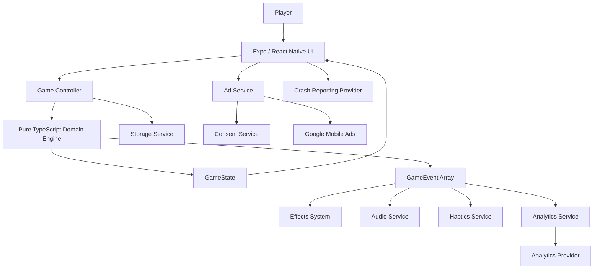

# BlastDown — Technical Design

**Document:** `TECHNICAL_DESIGN.md`
**Product:** BlastDown
**Version:** 1.0 Draft
**Status:** For Product Owner Review
**Primary platform:** Android
**Secondary platform:** iOS after Android validation
**Related document:** `PRD.md`

## A-04 V1 Scope Lock

This design implements the PRD's locked V1: the current core game and
active-run/session flows, rewarded Freeze and Defuse, local settings/profile,
consent/privacy, analytics/crash adapters, and Android-first release work.
Bolts, theme economy, Double Bolts, rewarded Revive, and interstitials are not
production capabilities. Legacy parsers and dormant pure helpers may remain
only where removing them would invalidate existing local data or require an
unrelated large-system rewrite; they must have no production route, UI offer,
placement identifier, analytics requirement, or settlement side effect.

---

# 1. Purpose

This document defines the technical architecture for BlastDown V1.

It describes:

- application architecture;
- approved technology stack;
- gameplay/domain boundaries;
- rendering architecture;
- effect delivery;
- persistence;
- audio;
- advertising and consent;
- analytics and crash reporting;
- build infrastructure;
- configuration;
- performance;
- security and privacy;
- testing;
- failure handling;
- major technical decisions.

This document does **not** redefine gameplay rules. Gameplay rules remain owned by the domain specification and `GAME_RULES.md`.

---

# 2. Architecture Objectives

BlastDown must be:

1. **Deterministic**
   The same seed and player actions should produce the same gameplay result.

2. **Offline-first**
   Core gameplay must work without network access.

3. **Testable**
   Gameplay logic must remain independent from React Native, animation, ads, and audio SDKs.

4. **Responsive**
   Dragging and placement must remain smooth on ordinary Android devices.

5. **Failure tolerant**
   Audio, ads, analytics, persistence, or effects failing must not corrupt gameplay.

6. **Simple enough for a solo developer**
   Do not introduce infrastructure that V1 does not need.

7. **Modular without overengineering**
   Use clear domain, UI, and service boundaries without generic frameworks or unnecessary abstraction.

---

# 3. System Overview

BlastDown is a local-first mobile application.



The **domain engine is the authoritative source of gameplay truth**.

Everything else reacts to that state.

---

# 4. Approved Technology Stack

## 4.1 Core

| Area                 | Technology                     |
| -------------------- | ------------------------------ |
| Framework            | React Native                   |
| Application platform | Expo                           |
| Language             | TypeScript                     |
| Type checking        | TypeScript strict mode         |
| Navigation           | Expo Router                    |
| Gesture handling     | React Native Gesture Handler   |
| Animation            | React Native Reanimated        |
| Cinematic rendering  | React Native Skia              |
| Persistence          | AsyncStorage                   |
| Haptics              | Expo Haptics                   |
| Audio                | `expo-audio`                   |
| Ads                  | React Native Google Mobile Ads |
| Native development   | Expo Dev Client                |
| Native builds        | EAS Build                      |
| Testing              | Jest + `jest-expo`             |
| Component testing    | React Native Testing Library   |
| Linting              | ESLint                         |
| Formatting           | Prettier                       |

`expo-av` must not be introduced.

Audio must use:

```text
expo-audio
```

---

# 5. Application Layers

BlastDown uses four primary layers.

```text
┌──────────────────────────────────────┐
│ Presentation / Screens / Rendering   │
├──────────────────────────────────────┤
│ Hooks / Controllers / Orchestration  │
├──────────────────────────────────────┤
│ Pure Gameplay Domain                 │
├──────────────────────────────────────┤
│ Service Adapters / Persistence       │
└──────────────────────────────────────┘
```

---

# 6. Domain Layer

Location:

```text
src/domain/
```

The domain contains all gameplay rules.

Examples:

```text
src/domain/
├── gameTypes.ts
├── shapes.ts
├── seededRandom.ts
├── placement.ts
├── lineClearing.ts
├── timers.ts
├── explosions.ts
├── scoring.ts
├── gameOver.ts
├── powerups.ts
├── reducer.ts
└── selectors.ts
```

Exact repository names may evolve, but the architectural boundary must remain.

---

# 7. Domain Responsibilities

The following must remain pure TypeScript:

- board state;
- piece shapes;
- seeded random generation;
- hand generation;
- placement validation;
- placement application;
- row detection;
- column detection;
- line clearing;
- timer assignment;
- timer decrement;
- Freeze effects;
- defuse detection;
- explosion resolution;
- rubble generation;
- rubble clearing;
- score calculation;
- combo calculation;
- game-over detection;
- power-up state changes.

Domain functions must not:

- access AsyncStorage;
- access React hooks;
- navigate;
- trigger animation;
- play audio;
- trigger haptics;
- call advertisement SDKs;
- access Skia;
- access Reanimated;
- send analytics directly.

---

# 8. Gameplay State

The active game is represented by a serializable `GameState`.

Representative model:

```ts
type CellKind = "empty" | "timed" | "normal" | "rubble";

type GridCell =
  | {
      kind: "empty";
    }
  | {
      kind: "timed";
      pieceInstanceId: string;
      colorId: string;
    }
  | {
      kind: "normal";
      colorId: string;
    }
  | {
      kind: "rubble";
      explosionId: string;
    };

type ActiveTimedPiece = {
  id: string;
  shapeId: string;
  remainingTurns: number;
  placedOnTurn: number;
  colorId: string;
};

type HandPiece = {
  handId: string;
  shapeId: string;
  colorId: string;
};

type GameStatus =
  | "ready"
  | "playing"
  | "paused"
  | "resolving"
  | "gameOver"
  | "awaitingRevive" // deprecated compatibility state; no V1 route enters it
  | "finished";

type GameState = {
  version: number;

  seed: string;
  rngState: number;

  turn: number;

  grid: GridCell[][];
  hand: HandPiece[];

  activeTimers: Record<string, ActiveTimedPiece>;

  score: number;
  combo: number;
  bestCombo: number;

  linesCleared: number;
  piecesPlaced: number;
  piecesDefused: number;
  explosions: number;
  rubbleCleared: number;

  freezeTurnsRemaining: number;

  rewardedFreezeUses: number;
  rewardedDefuseUses: number;

  reviveUsed: boolean; // deprecated compatibility marker; no V1 reward consumes it

  status: GameStatus;

  startedAt: number;
  lastUpdatedAt: number;
};
```

This representative model includes deprecated fields only because current
active-run validation must remain backward safe. The approved documents remain
authoritative; implementation changes must conform to them or be surfaced.

---

# 9. Reducer Contract

Gameplay mutations must occur through typed domain actions.

Conceptually:

```ts
type DomainResult = {
  state: GameState;
  events: readonly GameEvent[];
};
```

The domain returns:

1. the new authoritative state;
2. zero or more gameplay events describing what occurred.

The reducer does not execute animations or side effects.

---

# 10. GameEvent Architecture

`GameEvent` connects deterministic gameplay to presentation.

Representative events:

```ts
type GameEvent =
  | {
      type: "piecePlaced";
      cells: CellPosition[];
    }
  | {
      type: "linesCleared";
      rows: number[];
      columns: number[];
    }
  | {
      type: "pieceDefused";
      pieceId: string;
      bonus: number;
    }
  | {
      type: "timerWarning";
      pieceId: string;
      remainingTurns: number;
    }
  | {
      type: "explosion";
      explosionId: string;
      cells: CellPosition[];
    }
  | {
      type: "comboChanged";
      combo: number;
    }
  | {
      type: "gameOver";
    };
```

Additional event types may exist in production.

## Rules

- Domain events describe facts.
- Domain events do not describe animation implementation.
- UI consumes events for visual feedback.
- Audio consumes events for sound.
- Haptics consume events for physical feedback.
- Analytics may map selected events into telemetry.
- Presentation failure must never roll back gameplay.

---

# 11. Controller Layer

The controller/hook layer coordinates React and the pure domain.

Representative components:

```text
src/hooks/
├── useGameController.ts
├── useGamePersistence.ts
├── useEventAnimator.ts
├── useAppLifecycle.ts
├── useAudio.ts
└── useHaptics.ts
```

Responsibilities include:

- dispatching domain actions;
- exposing derived state to screens;
- processing domain events;
- saving active runs;
- handling app lifecycle;
- coordinating optional services.

The controller must not become a second gameplay engine.

---

# 12. Rendering Architecture

BlastDown now uses a **hybrid rendering architecture**.

The original architecture used React Native Views for the board.

The cinematic visual direction later required:

- colored outer glow;
- bloom;
- additive/light-based effects;
- richer board-level rendering.

Therefore Skia is now permitted for the cinematic board renderer.

---

# 13. Renderer Separation

React Native continues to own:

- screen layout;
- score HUD;
- best score;
- pause control;
- piece tray;
- power-up controls;
- settings;
- modals;
- navigation;
- accessibility controls.

Skia may own:

- board frame;
- grid;
- placed blocks;
- timer numerals;
- rubble;
- placement previews;
- drag ghost;
- line-clear effects;
- explosion effects;
- cinematic lighting.

This avoids converting the whole application into a graphics canvas.

---

# 14. Board Renderer Contract

Both renderers must consume the same gameplay/presentation contract.

```text
BoardRenderer
├── React Native fallback
└── Cinematic Skia renderer
```

Renderer choice must never change:

- placement rules;
- line-clear rules;
- timers;
- explosions;
- scoring;
- power-ups;
- persistence;
- rewards.

---

# 15. Cinematic Renderer Feature Flag

The cinematic renderer is controlled by:

```text
EXPO_PUBLIC_CINEMATIC_BOARD
```

Default:

```text
OFF
```

Valid opt-in values:

```text
1
true
skia
```

The values are intentionally exact and case-sensitive.

These must not enable the renderer:

```text
True
SKIA
 true
```

---

# 16. Static Bundle Isolation

The cinematic renderer must not merely be disabled at runtime.

When the feature flag is OFF:

1. Skia must not initialize.
2. Cinematic modules should not appear in the production dependency graph.

Therefore the `require()` must exist inside a branch Metro can remove.

Conceptual pattern:

```ts
if (process.env.EXPO_PUBLIC_CINEMATIC_BOARD === "1") {
  return require("./cinematicRenderer");
}
```

The exact repository implementation may support the other approved literal values.

Do not wrap this decision in runtime helpers that prevent Metro from statically eliminating the dependency.

Bundle-level tests are required.

---

# 17. Effect Pipeline

The effect system is presentation-only.

Current flow:

```text
GameEvent[]
      ↓
useEventAnimator
      ↓
buildEffectPlan()
      ↓
EffectSequence[]
      ↓
effectQueue
      ↓
drawOrder()
      ↓
Renderer
```

---

# 18. Effect Queue

The queue exists because multiple gameplay outcomes may occur during the same period.

For example:

```text
line clear
+
defuse
+
explosion
```

must not overwrite one another.

Current queue requirements:

```text
Maximum accepted effects: 6
```

Each effect has:

- unique ID;
- session generation;
- priority;
- independent start;
- independent progress;
- independent completion.

Priority:

```text
critical
high
standard
```

Draw order:

```text
standard
↓
high
↓
critical
```

---

# 19. Effect Identity

Effects must be keyed by stable IDs.

Example conceptual format:

```text
s{session}:t{turn}:...
```

Two effects of the same type must not collapse because they share a type name.

---

# 20. Effect Lifetime

One effect completing must not:

- restart another;
- reset another;
- retire another;
- change another's animation progress.

Board rerenders must not remount active effects unnecessarily.

---

# 21. Cinematic Clock Ownership

Animation clocks must be owned by effect identity.

They must **not** be owned by effect array position.

Bad:

```text
effects[0] → clock 0
effects[1] → clock 1
```

because sorting or retirement can move an effect between indexes.

Required model:

```text
effect ID A → leased clock 0
effect ID B → leased clock 1
```

A survivor retains its clock until it retires.

Freed slots may then be reused.

---

# 22. Session Isolation

Transient effects belong to a gameplay session generation.

The following must clear old transient effects:

- restart;
- new run;
- Home;
- screen unmount;
- session-generation change.

An effect from a previous run must never appear during a new run.

---

# 23. Development Effect Harness

The project includes a development-only effect harness for deterministic QA.

It may trigger scenarios including:

- single clear;
- simultaneous row and column clear;
- same-type concurrent effects;
- clear + defuse;
- clear + explosion;
- multiple explosions;
- six rapid effects;
- seventh-event eviction;
- restart during active effects.

The harness must use the real public effect pipeline.

It must not call renderer internals directly.

---

# 24. Development Bundle Exclusion

Development tooling must not ship in production.

Correct structural pattern:

```ts
if (__DEV__) {
  return require("./EffectHarnessScreen").EffectHarnessScreen;
}

return null;
```

Putting the `require()` outside the statically removable branch is not sufficient.

Production exports must be checked for harness markers.

---

# 25. Input Architecture

Interaction flow:

```text
Touch / Gesture
      ↓
Candidate board anchor
      ↓
Domain placement selector
      ↓
Valid / invalid result
      ↓
Placement preview
      ↓
Release
      ↓
Domain action
```

The UI may convert screen coordinates to board coordinates.

The UI must not independently determine whether a placement is legal.

---

# 26. Pre-Clear Preview Architecture

The future pre-clear preview must reuse gameplay/domain placement information.

It should determine:

```text
candidate placement
→ affected rows
→ affected columns
```

The preview:

- is presentation-only;
- does not modify `GameState`;
- updates when the drag anchor changes;
- should not update React state every animation frame.

---

# 27. State Management

Do not add:

- Redux;
- MobX;
- Zustand;
- another global state-management framework.

Use:

- pure TypeScript domain state;
- typed reducer/controller;
- local React state;
- React Context for application-level services/preferences where appropriate;
- AsyncStorage for persistence.

This is sufficient for V1.

---

# 28. Persistence

## 28.1 Technology

Use AsyncStorage behind a storage abstraction.

Example:

```text
src/services/storage/
├── StorageService.ts
├── activeRunStorage.ts
├── progressStorage.ts
└── settingsStorage.ts
```

---

# 29. Persisted Data

Persist where applicable:

- best score;
- active run;
- settings;
- sound preference;
- music preference;
- haptics preference;
- reduced-motion preference;
- tutorial completion;
- selected theme;
- theme unlocks where retained;
- lifetime statistics;
- consent-related state where appropriate.

Persisted structures require:

```text
schema version
+
migration mechanism
```

---

# 30. Active Run Saving

Save the active run:

- after every completed turn;
- when the app backgrounds;
- when the player pauses;
- before a rewarded advertisement.

---

# 31. Active Run Restore

Restoring a run must restore:

- board;
- pieces;
- hand;
- timers;
- score;
- combo;
- RNG state;
- seed;
- Freeze state;
- power-up state;
- statistics;
- run status.

Timers are placement-based.

Therefore:

```text
time spent outside the app
does NOT decrement timers
```

---

# 32. Service Adapter Architecture

External/native capabilities must be hidden behind typed adapters.

Required service boundaries:

```text
AdService
ConsentService
StorageService
AnalyticsService
AudioService
HapticsService
```

Do not create a generic dependency-injection framework.

Use ordinary typed composition and React Context at the application boundary.

---

# 33. Advertising Architecture

Screens must not call Google Mobile Ads directly.

Example interface:

```ts
interface AdService {
  preloadRewarded(placement: RewardedPlacement): Promise<void>;

  showRewarded(
    placement: RewardedPlacement,
  ): Promise<"earned" | "closed" | "unavailable" | "error">;
}
```

Implementations:

```text
MockAdService
GoogleMobileAdsService
```

---

# 34. Reward Semantics

An advertisement being opened does not grant a reward.

Reward flow:

```text
Player chooses power-up
        ↓
Game state persisted
        ↓
Rewarded ad requested
        ↓
SDK displays ad
        ↓
SDK reports reward earned
        ↓
Reward granted exactly once
```

Possible failure outcomes:

```text
unavailable
closed
error
```

None of these grant the reward.

---

# 35. Ad Failure Handling

Gameplay must survive:

- no internet;
- ad unavailable;
- load failure;
- playback failure;
- early close;
- background during advertisement;
- late callback;
- duplicate callback.

Reward application must be idempotent.

---

# 36. Consent

Production advertising requires the consent capability provided by the Google Mobile Ads integration.

Consent must be separate from the game engine.

Gameplay should remain functional even if:

- consent cannot be requested;
- advertising cannot initialize;
- the user is not eligible for personalized advertising.

---

# 37. Audio Architecture

Use:

```text
expo-audio
```

Do not use:

```text
expo-av
```

Audio must never affect gameplay correctness.

---

# 38. AudioService

One application-level `AudioService` should manage audio resources.

Responsibilities:

- preload assets;
- keep reusable players;
- separate music and SFX;
- optionally support voice later;
- obey user settings;
- throttle rapid repeated sounds;
- pause/reduce music when backgrounded;
- handle advertisements;
- restore safely;
- release resources on teardown.

Do not create a new audio player every time a player taps the board.

---

# 39. Audio Channels

Recommended channels:

```text
music
sfx
voice
```

Voice is optional and may remain unused in V1.

---

# 40. Audio Manifest

Centralize sound configuration:

```text
src/config/audioManifest.ts
```

Each entry should define:

```text
file
channel
default volume
minimum retrigger interval
pitch variation allowed
reduced-audio behavior
production/placeholder status
license record
```

---

# 41. Combo Audio

The line-clear combo ladder may use one base sound:

```text
combo 1     base pitch
combo 2     +1 semitone
combo 3     +2 semitones
...
maximum     +12 semitones
```

Reset the ladder when the combo ends.

If device playback quality is poor, use a small set of pre-rendered licensed variants instead.

---

# 42. Audio Licensing

Production audio must be documented in:

```text
assets/licenses/AUDIO_LICENSES.md
```

For every external sound record:

- filename;
- source URL;
- author;
- license;
- commercial-use permission;
- attribution requirement;
- acquisition date;
- modifications.

Unlicensed audio must not ship.

---

# 43. Haptics

Use Expo Haptics behind an application-level abstraction.

Haptics may support:

- piece pickup;
- valid placement;
- line clear;
- important combo;
- timer danger;
- explosion;
- defuse.

Haptics must:

- respect the settings toggle;
- be throttled;
- never convey information unavailable visually.

---

# 44. Analytics

Use a provider-independent analytics interface.

Possible V1 events:

```text
app_open
tutorial_started
tutorial_completed

run_started
run_resumed
run_abandoned
run_finished

line_clear
multi_line_clear

piece_defused

timer_reached_two
timer_reached_one

explosion_occurred

reward_offer_shown
reward_ad_started
reward_ad_earned
reward_ad_closed_without_reward
reward_ad_error

immediate_replay

settings_changed
```

Do not emit analytics for:

- each rendered cell;
- each animation frame;
- each Skia draw.

---

# 45. Run Summary Analytics

Prefer aggregated run-level analytics.

`run_finished` may include:

```text
duration
final score
turn count
pieces placed
lines cleared
best combo
defuses
explosions
rubble created
rubble cleared
rewarded actions used
revive used
end reason
run seed
app version
```

---

# 46. Custom Backend

BlastDown V1 has:

```text
NO custom backend
```

Therefore V1 has no:

- application database server;
- REST API;
- GraphQL API;
- account server;
- login system;
- cloud save;
- multiplayer server;
- leaderboard backend.

Core gameplay is fully local.

---

# 47. External Services

BlastDown may communicate with:

- Google Mobile Ads;
- consent infrastructure;
- analytics provider;
- crash-reporting provider;
- EAS Build infrastructure.

Gameplay must not depend on these services.

---

# 48. Authentication

V1 has no player account system.

Therefore:

```text
Authentication: none
```

There is no:

- email login;
- social login;
- password;
- access token;
- refresh token.

---

# 49. Authorization

V1 has no server-authorized user actions because there is no custom backend.

Therefore:

```text
Authorization: none for player accounts
```

Development-only features are controlled by build/development configuration, not player roles.

---

# 50. Security Model

V1 security focuses on:

- protecting build credentials;
- preventing secrets from entering source control;
- minimizing collected data;
- preventing debug tooling from shipping;
- controlling native dependencies;
- safely handling ad callbacks;
- maintaining licensing records.

---

# 51. Client Trust Model

Because all gameplay is local, BlastDown does **not** attempt to make local score data tamper-proof.

A determined user could manipulate locally stored values.

This is acceptable for:

```text
local best score
```

It would **not** be acceptable for:

```text
competitive global leaderboard
```

If online competition is added later, score validation must move to a server-authoritative design.

---

# 52. Secrets

Never commit:

- private API keys;
- service-account credentials;
- Android signing keys;
- keystores;
- backend credentials;
- private certificates.

Client-visible configuration such as AdMob identifiers is not an authentication secret, but should still be environment-specific.

---

# 53. Environment Configuration

Use:

```text
.env.example
app.config.ts
EAS environment configuration
```

for configuration.

Possible configuration includes:

```text
EXPO_PUBLIC_CINEMATIC_BOARD

AdMob app identifiers
AdMob unit identifiers

privacy policy URL

analytics configuration

crash-reporting configuration
```

Missing production configuration should fail clearly during validation rather than silently produce an unsafe build.

---

# 54. Development Environments

Support:

```text
Development
Preview / Internal QA
Production
```

Development:

- mock/test ads;
- diagnostics;
- harnesses;
- debugging.

Preview:

- native production-like integrations;
- internal testing.

Production:

- production identifiers;
- diagnostics excluded;
- final consent configuration.

---

# 55. EAS Build

EAS Build is the primary native build system.

Expected profiles:

```text
development
preview
production
```

Android is the first release gate.

---

# 56. Production Bundle Validation

A successful compile is not enough.

Production validation must verify:

### Cinematic OFF

The bundle does not contain cinematic renderer markers.

### Cinematic ON

The cinematic renderer exists.

### Production

The effect harness and other development-only tooling are absent.

These checks are required because runtime tests cannot prove dead-code elimination.

---

# 57. App Lifecycle

Lifecycle coordination should handle:

- persistence;
- audio;
- transient effects;
- ads;
- background/resume.

---

# 58. Background Behavior

When the application backgrounds:

1. save the active run;
2. pause/reduce music;
3. do not decrement timers;
4. preserve gameplay state;
5. prevent stale presentation state from leaking into another session.

---

# 59. Resume Behavior

When the application resumes:

1. restore gameplay if needed;
2. restore audio safely;
3. do not duplicate rewards;
4. do not replay completed effects;
5. do not decrement timers based on elapsed time.

---

# 60. Performance Requirements

Primary target:

```text
smooth interaction on common
budget and mid-range Android devices
```

Engineering rules:

- no permanent JavaScript game loop;
- no long-running JS timers;
- no per-frame React state;
- no continuous unbounded particles;
- no repeated native SDK initialization;
- no audio-player creation on every action;
- avoid unnecessary board rerenders;
- preload short SFX;
- preload ads before urgent moments.

---

# 61. Skia Performance Rules

Use:

```text
one board canvas
```

where practical.

Avoid:

- one expensive blur pass per cell;
- unnecessary saveLayers;
- hundreds of particles;
- independent animated state for all 64 cells.

Prefer:

- shared animation values;
- grouped effects;
- layer-level bloom;
- bounded effect scenes.

---

# 62. Effect Performance

Current live queue limit:

```text
6 effects
```

Effects must remain bounded.

Particles must remain limited.

Do not increase particle density until real Android profiling demonstrates acceptable performance.

---

# 63. Performance Measurement

Automated tests cannot prove frame rate.

Physical-device testing must measure or observe:

- drag responsiveness;
- frame consistency;
- effect latency;
- multiple simultaneous effects;
- progressive slowdown;
- memory behavior;
- ten-minute gameplay stability.

The cinematic renderer must remain OFF by default until this validation is complete.

---

# 64. Accessibility

Architecture must support:

- numerical timer labels;
- color-independent danger communication;
- haptics toggle;
- sound toggle;
- music toggle;
- reduced-motion toggle;
- safe-area layouts;
- small Android screens;
- large touch targets.

Reduced motion must preserve essential information.

---

# 65. Failure Handling

| Failure                     | Required response            |
| --------------------------- | ---------------------------- |
| Audio failure               | Continue silently            |
| Haptics failure             | Continue normally            |
| Analytics failure           | Ignore/defer event           |
| Crash service failure       | Never affect gameplay        |
| Ad unavailable              | No reward; return to game    |
| Ad closed early             | No reward                    |
| Duplicate ad callback       | Reward once                  |
| Storage write failure       | Keep current in-memory state |
| Corrupt saved run           | Reject/migrate safely        |
| Cinematic renderer disabled | Use fallback renderer        |
| Effect queue full           | Deterministic eviction       |
| Background during effect    | No stale duplicate on resume |
| No internet                 | Core game remains playable   |

---

# 66. Testing Strategy

Testing is divided into:

1. domain unit tests;
2. component tests;
3. integration tests;
4. renderer contract tests;
5. bundle-level tests;
6. physical-device QA.

---

# 67. Domain Unit Tests

Required areas include:

- valid placement;
- invalid placement;
- overlap;
- boundaries;
- rows;
- columns;
- simultaneous row + column;
- timer assignment;
- timer decrement;
- Freeze;
- defuse;
- explosion;
- multiple explosions;
- rubble;
- score;
- combos;
- seeded generation;
- game over;
- persistence migration.

---

# 68. Renderer Tests

Both renderers must verify:

- multiple queued effects reach rendering;
- same-type effects have unique IDs;
- effects animate independently;
- one retirement does not restart another;
- priority ordering;
- restart clears old effects;
- board rerenders preserve active effects;
- feature flag OFF does not evaluate Skia.

---

# 69. Bundle Tests

Tests concerning production exclusion must use Metro/Babel transformation or actual exported bundle inspection.

Do not claim bundle exclusion based only on:

- source scanning;
- runtime behavior;
- mocked imports.

---

# 70. Red-Before-Fix Rule

For a reproducible defect:

```text
1. Write regression test
2. Run against buggy implementation
3. Confirm RED
4. Implement fix
5. Confirm GREEN
6. Run full relevant suite
```

A test that cannot fail against the defect is not sufficient regression evidence.

---

# 71. Required Verification

Applicable changes should run:

```bash
npm run typecheck
npm run lint
npm run format:check
npm run test
npm run test:coverage
npx expo-doctor
```

Renderer/native changes additionally require:

- Android export;
- relevant flag variants;
- physical Android QA.

---

# 72. Physical Android Test Matrix

At minimum:

- small-screen Android;
- normal/mid-range Android;
- budget/low-memory device where available;
- current Android;
- older supported Android;
- offline mode;
- slow network;
- ad unavailable;
- ad closed;
- ad error;
- background during run;
- background during ad.

---

# 73. Observability

Development diagnostics may expose:

```text
effect queue depth
rendered effect count
accepted count
completed count
evicted count
dropped count
effect IDs
effect priorities
clock leases
session generation
renderer flag
enqueue-to-start latency
```

Do not log every frame.

---

# 74. Structured Effect Logs

Allowed lifecycle logs include:

```text
enqueue
accepted
startedDrawing
completed
evicted
sessionCleared
```

Logging must remain development-focused and bounded.

---

# 75. No Premature Abstraction

Do not create:

- entity-component systems;
- custom generic game engines;
- dependency-injection containers;
- plugin engines;
- custom event-bus packages;
- unnecessary repositories;
- complex state machines where a typed reducer is sufficient.

---

# 76. Major Technical Decisions

| ID     | Decision                                        |
| ------ | ----------------------------------------------- |
| TD-001 | Android-first                                   |
| TD-002 | React Native + Expo                             |
| TD-003 | Strict TypeScript                               |
| TD-004 | Expo Router                                     |
| TD-005 | Pure TypeScript gameplay domain                 |
| TD-006 | Typed reducer instead of global state framework |
| TD-007 | AsyncStorage local persistence                  |
| TD-008 | No custom V1 backend                            |
| TD-009 | GameEvent output for presentation side effects  |
| TD-010 | Service adapters around SDKs                    |
| TD-011 | `expo-audio` only                               |
| TD-012 | Hybrid React Native + Skia renderer             |
| TD-013 | Cinematic renderer OFF by default               |
| TD-014 | Static Metro-foldable renderer gate             |
| TD-015 | Effect queue capped at 6                        |
| TD-016 | Independent effect lifetime                     |
| TD-017 | Clock ownership by effect ID                    |
| TD-018 | Session-generation isolation                    |
| TD-019 | Development harness excluded from production    |
| TD-020 | No permanent JS game loop                       |
| TD-021 | Placement-based timers                          |
| TD-022 | Red-before-fix regression testing               |
| TD-023 | Bundle tests for bundle claims                  |
| TD-024 | Physical Android QA required                    |

---

# 77. Rejected V1 Architecture

Do not introduce without explicit approval:

```text
Custom backend
User accounts
Cloud saves
Global leaderboard
Multiplayer
WebSockets
Redux
MobX
Zustand
Generic event bus
Dependency injection framework
ECS
Server-authoritative state
Continuous realtime game loop
```

---

# 78. Current Technical Status

At the time this design was prepared:

### Implemented / established

- pure gameplay domain;
- event-driven presentation architecture;
- React Native fallback board;
- Skia cinematic renderer;
- static cinematic bundle gate;
- multi-effect queue;
- independent effect sequences;
- stable effect clock leasing;
- development effect harness;
- effect diagnostics;
- Android production bundle exclusion tests;
- rewarded-ad service architecture;
- local persistence architecture;
- strict test/lint/typecheck workflow.

### Still requiring final V1 work

- physical-device cinematic performance approval;
- final game-feel pass;
- pre-clear preview;
- praise/celebration system completion;
- production audio system/assets;
- final music;
- final analytics/crash provider;
- final production consent/ad configuration;
- release-device matrix;
- production release QA.

---

# 79. Open Technical Decisions

Before V1 release, confirm:

1. Minimum supported Android version.
2. Whether cinematic rendering becomes the default.
3. Final Android performance acceptance thresholds.
4. Analytics provider.
5. Crash-reporting provider.
6. Final production audio assets.
7. Final music format/compression.
8. Final consent configuration.
9. Interstitial ads are excluded from V1.
10. Whether iOS ships with Android or later.
11. No optional progression fields drive V1 behavior; legacy fields remain parse-only where required for compatibility.
12. Final production renderer fallback strategy if Skia initialization fails unexpectedly.

---

# 80. Architecture Change Control

Explicit technical-lead approval is required before changing:

- domain interfaces;
- timer rules;
- explosion rules;
- scoring contracts;
- persistence schema;
- renderer contract;
- effect queue contract;
- service interfaces;
- ad reward semantics;
- analytics schema;
- native dependencies;
- feature-flag behavior;
- backend architecture;
- authentication;
- authorization.

Approved deviations must be recorded in:

```text
docs/DECISIONS.md
```

---

# 81. Codex Engineering Rules

Codex should treat this document as an architectural constraint.

Codex may implement scoped work within approved boundaries but must not independently:

- change gameplay rules;
- add a backend;
- add state-management frameworks;
- change persistence schema;
- change ad semantics;
- replace Expo Router;
- change renderer architecture;
- upgrade native dependencies;
- change feature-flag semantics.

For architecture-affecting work, Codex should report the requested change rather than implementing it silently.

---

# 82. Technical Definition of Done

A BlastDown V1 release candidate is technically ready only when:

## Domain

- gameplay remains deterministic;
- seeded runs are reproducible;
- timer/explosion behavior is covered;
- restart produces clean state.

## Persistence

- best score persists;
- settings persist;
- active run restoration works;
- migrations work.

## Rendering

- fallback renderer works;
- cinematic renderer works;
- simultaneous effects remain independent;
- no known Fabric/Skia crash remains;
- cinematic OFF excludes the cinematic dependency tree.

## Effects

- queue remains bounded;
- effects do not overwrite each other;
- no stale-session effects occur;
- no progressive effect slowdown occurs.

## Audio

- SFX preload correctly;
- music behaves correctly;
- sound/music toggles work;
- resources do not leak;
- failures remain non-blocking.

## Ads

- rewarded flows work;
- rewards occur exactly once;
- failure does not alter gameplay;
- consent flow works.

## Performance

- physical Android testing completed;
- dragging remains responsive;
- no increasing memory/performance degradation;
- busy effect scenarios remain playable.

## Quality

- typecheck passes;
- lint passes;
- format check passes;
- tests pass;
- coverage reviewed;
- Expo Doctor passes;
- Android build/export passes.

## Production safety

- no secrets committed;
- development harness excluded;
- required licenses recorded;
- privacy/consent configuration complete.

---

# 83. Relationship to Remaining Documents

The remaining project documents should build on this architecture.

### `APP_FLOW.md`

Defines:

- screens;
- routes;
- navigation;
- loading/error/empty states;
- ad and permission flows.

### `UI_UX_BRIEF.md`

Defines:

- visual system;
- responsive layout;
- component appearance;
- animations;
- feedback hierarchy;
- accessibility presentation.

### `BACKEND_DESIGN.md`

Defines:

- local data boundaries;
- external services;
- absence of custom V1 backend;
- APIs;
- authentication;
- authorization;
- future backend triggers.

### `ENGINEERING_PLAN.md`

Defines:

- task order;
- dependencies;
- ownership;
- test requirements;
- release gates;
- definitions of done.

No later document should silently override this architecture.

---

# 84. Final Architecture Principle

The central technical rule for BlastDown is:

> **Gameplay determines what happened. Presentation determines how it feels. External services must never determine whether the game remains correct.**

The architecture should remain as small as possible while preserving that separation.
